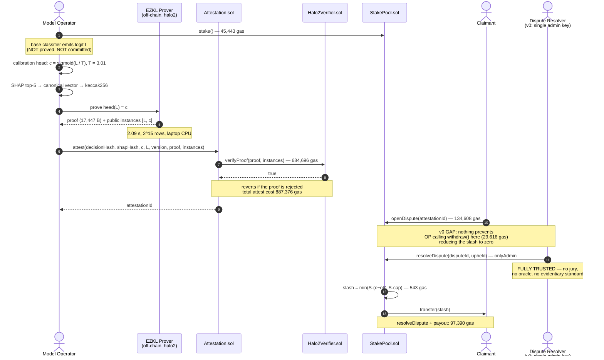

# Brier: Confidence-Calibrated Slashing for On-Chain AI Decision Accountability

**A research proposal and v0 implementation report**

Repository: <https://github.com/Sagexd08/Brier> · Version: v0 (prototype) · Date: August 2026

---

## Abstract

Accountability mechanisms for automated decisions penalise error at a
confidence-independent rate, so an operator is never punished for asserting 99%
confidence in a decision it believes at 60%. We propose slashing staked
collateral by the **Brier score** over (reported confidence, adjudicated
outcome). Because that score is strictly proper, expected loss is minimised
exactly when the operator reports its true subjective probability, making honest
confidence reporting loss-minimising rather than good faith. We report a
measured prototype: temperature scaling cuts Expected Calibration Error from
0.2164 to 0.1111 on held-out UCI German Credit data; an EZKL/halo2 circuit
proves the calibration head in 2.09 s on a laptop CPU; the proof verifies
on-chain for 684,696 gas. This is a mechanism and a prototype, **not a
deployable protocol**: only the calibration head is proved, its input logit is
unverified, dispute resolution is one admin key, and no unbonding period exists.

---

## 1. Motivation

### 1.1 The regulatory setting

Automated credit decisions are moving into a compliance regime that demands
records rather than assurances.

Under the EU AI Act, credit scoring is a high-risk application, and Article 26
places operational duties on **deployers** of such systems. Article 26(5)
requires deployers to "monitor the operation of the high-risk AI system on the
basis of the instructions for use" and to notify providers of risks or serious
incidents without undue delay. Article 26(6) requires deployers to "keep the
logs automatically generated by that high-risk AI system … for a period
appropriate to the intended purpose … of at least six months." Article 86
establishes a right to explanation of individual decision-making. Article 26
becomes applicable on 2 December 2027 for most high-risk systems, with an
extended deadline of 2 August 2028 for systems in employment, education, and
access to essential services [1].

These provisions mandate *logging and explanation*. They do not establish that
the logs are truthful, nor do they price the difference between a wrong decision
made tentatively and a wrong decision made with asserted certainty. A deployer
that logs a confidently wrong decision is compliant with Article 26(6).

**A note on the Indian setting, correcting a common assumption.** The RBI
Digital Lending Directions, 2025 are frequently cited as imposing algorithmic
transparency duties. They do not. The RBI Working Group recommended that
regulated entities "document the rationale for algorithmic features and conduct
regular algorithmic audits," but these recommendations were incorporated into
neither the 2022 Guidelines nor the 2025 Directions, which remain silent on
algorithmic fairness and transparency [2]. We therefore cite India as an example
of a **regulatory gap** rather than a regulatory driver. We were unable to
locate a provision in the 2025 Directions imposing model-explainability
obligations, and we do not assert one exists.

The honest framing is that regulation currently creates demand for *auditable
records of automated decisions* and does not yet create demand for *calibrated
confidence*. This proposal argues the latter is the more useful object, not that
it is presently required.

### 1.2 The gap in existing mechanisms

Decentralised protocols already slash staked collateral for misbehaviour, and
already run decentralised claim adjudication. Neither weights the penalty by the
reporter's own stated confidence.

- **Oracle slashing.** Chainlink slashes node operators for failing on-chain
  service-level obligations at a **fixed 700 LINK per valid alerting event** on
  the ETH/USD data feed, with the alerter rewarded 7,000 LINK [3]. The penalty
  is a constant: it is identical whether the operator was marginally or
  egregiously wrong, and oracles do not report confidence at all.
- **Decentralised insurance.** Nexus Mutual resolves claims by stake-weighted
  member voting, with claim assessors staking NXM and rewarded for voting with
  the outcome [4]. The mechanism adjudicates *whether a claim is valid*; it does
  not score how confident anyone was.
- **On-chain proper scoring rules.** These do exist. Foresight Arena
  (arXiv:2605.00420) scores AI forecasting agents on Polymarket questions using
  the Brier score, with commitments and scores recorded on Polygon PoS via
  smart contracts [5].

The precise delta is therefore narrower than "nothing like this exists," and we
state it as such: **proper scoring rules have been applied on-chain to *reward*
forecasters in prediction-market settings; we are not aware of prior work
applying one to *slash staked collateral* of a model operator under dispute, with
the scored quantity produced by a zero-knowledge-proved calibration step.**
Foresight Arena is reward-based, involves no staked collateral at risk, no
slashing, and no zero-knowledge proofs [5]. We claim novelty in the combination,
not in any component.

---

## 2. Related work

### 2.1 zkML and verifiable inference

EZKL compiles computational graphs supplied in ONNX format into arithmetic
circuits and produces zk-SNARK proofs of correct model execution, using a
modified halo2 with Plonkish arithmetisation; anyone holding the verifying key
can check the proof [6]. This prototype uses EZKL 23.0.5 directly. The broader
design question EZKL raises — that proving cost scales with the proved
subgraph — is what motivates proving a small calibration head rather than a full
classifier, and is examined empirically in §6.3.

### 2.2 Decentralised oracle staking and slashing

Chainlink's staking design uses on-chain service-level agreements, community
alerting, and fixed-size slashing penalties [3]. Nexus Mutual's claim assessment
uses stake-weighted voting with a quorum, escalation to a full member vote, and
reward for majority-aligned voting [4]. Kleros provides general decentralised
arbitration: jurors are drawn from PNK stakers, self-select into sub-courts, vote
on evidence, and are rewarded for voting with the majority under a Schelling-point
incentive, with appeals heard by successively larger juries [7]. Kleros is the
most plausible substitute for this prototype's trusted administrator (§8).

### 2.3 Calibration in machine learning

Guo et al. show that modern neural networks are poorly calibrated, and that
temperature scaling — a single-parameter extension of Platt scaling that divides
logits by a learned $T > 0$ fitted on held-out data — is surprisingly effective
at restoring calibration [8]. Temperature scaling is the primary calibration
method here, chosen both for its empirical strength and because a
single-parameter map is trivially cheap to arithmetise.

### 2.4 Proper scoring rules

Brier introduced the mean-squared-error score for probability forecasts of
binary outcomes [9]. Gneiting and Raftery develop the general theory: a scoring
rule is *proper* if the forecaster maximises expected score by issuing its true
predictive distribution $F$ rather than any $G \neq F$, and *strictly proper* if
that maximum is unique [10]. The Brier score is strictly proper, which is the
sole property this mechanism depends on.

---

## 3. Core contribution

**Claim (testable).** Defining the slash on a disputed decision as
$\text{slash} = S \cdot (c - o)^2$, where $S$ is staked collateral, $c \in [0,1]$
the operator's reported confidence that its decision was correct, and
$o \in \{0,1\}$ the adjudicated outcome, yields a mechanism in which reporting
the operator's true subjective probability minimises expected loss — so honest
confidence reporting is the loss-minimising strategy rather than an assumption —
and this is implementable today, with the confidence-producing step proved in
zero knowledge at 2.09 s on a commodity CPU and verified on-chain for 684,696 gas.

**Scope conditions, stated as part of the claim rather than as caveats.** The
properness argument holds *conditional on* the adjudicated outcome being
truthful, and on dispute selection being independent of the reported confidence.
Neither condition is guaranteed by this prototype. Specifically:

1. **Input-logit provenance is unproven.** The circuit takes the base model's
   logit as an unverified public input. An operator that fabricates the logit
   obtains a proof that verifies. The proof binds the calibration step, not the
   pipeline (Figure C, tier 1; `ThreatModel.t.sol::test_tier1_marginIsUnverifiedOperatorSuppliedInput`).
2. **Off-chain misreporting before proving is not prevented.** Nothing forces
   the operator to feed the circuit the logit its deployed model actually
   produced.
3. **Selective disputes break the properness argument.** If only rejections are
   ever disputed, the operator faces an asymmetric loss surface, and the
   dominant strategy under that surface is not analysed here.

The mechanism is proper; the *system* is proper only to the extent that these
conditions hold, and in v0 they do not.

---

## 4. System design

### 4.1 Figure A — Component architecture


Solid outlines mark components implemented and measured in the repository;
dashed amber marks specified-but-unbuilt. Red marks the single component inside
the zk circuit. The base classifier and the SHAP explainer sit outside the
circuit by design; the SHAP vector is hash-committed as evidence only.

### 4.2 Figure B — Protocol sequence

Rendered below for PDF export; the source is inline Mermaid (and
`figures/figure-b-sequence.mmd`) so it also renders natively on GitHub.




### 4.3 Figure C — Trust boundaries and threat model


This is the diagram against which every other claim in this document should be
checked. Three tiers:

- **Tier 1 (cryptographically guaranteed, green).** Calibration-head execution
  and the slash arithmetic. Holds against a fully malicious operator.
- **Tier 2 (economically assumed, amber).** Assumption A (honest confidence
  reporting) is enforced by the payoff structure, conditionally. **Assumption B
  (stake is available when slashed) is BROKEN in v0** — hatched red in the
  figure — because `withdraw()` has no unbonding period.
- **Tier 3 (fully trusted, red).** Dispute outcome and ground truth. A single
  key decides who loses money.

Each weakness in the figure names the test that demonstrates it. The v0 attack
path requires no cryptographic work: fabricate the logit (tier 1 does not bind
it), or front-run the dispute with `withdraw()` (tier 2), or rely on the admin
key (tier 3).

### 4.4 Figure D — Calibration reliability


Bin values are read directly from `artifacts/calibration/phase1_report.json`; no
curve is fitted or smoothed. Left: uncalibrated, ECE 0.2164, with a bin at mean
confidence 0.5430 whose empirical frequency is 0.0000. Centre: after temperature
scaling with $T = 3.01$, ECE 0.1111. Right: ECE across heads, including the
leakage control described in §5.2.

---

## 5. Methodology

### 5.1 Dataset and model

UCI Statlog German Credit: 1,000 real credit applications, 20 attributes,
downloaded at build time. The label is inverted so that the positive class is
*reject*. Attribute 9 (personal status and sex) is dropped, leaving 19 features
(see §7.4). Split 60/20/20 into train (600) / calibration (200) / test (200),
stratified, seed 42, with mutual disjointness asserted in code.

The base model is XGBoost (depth 8, 400 trees, learning rate 0.3, no
regularisation) and is **deliberately overfit**: train accuracy 1.0000, test
accuracy 0.7150. This is a methodological choice, not a tuned result.
Demonstrating a calibration-insurance mechanism on an already-calibrated model
would establish nothing; the overfit regime reproduces the overconfidence that
makes calibration worth insuring. The base model's accuracy is not a claim of
this work.

### 5.2 Calibration

Two heads were implemented and both are proved:

| Head | Parameters | Form |
|---|---|---|
| Temperature scaling | 1 | $\sigma(L/T)$, $T$ learned in log-space |
| MLP | 321 | $1 \to 16 \to 16 \to 1$, ReLU |

Both emit a **logit**, with the sigmoid applied outside the module, so the
circuit is affine + ReLU only and contains no transcendental function.

Both are fitted on the **calibration split only**. To show this matters rather
than assert it, every run includes a control that fits the same head on the
*training* split: that control yields $T = 0.1344$ and test ECE 0.2773, which is
**worse than not calibrating at all** (0.2164). Fitting on training data
*sharpens* an already-overconfident model.

### 5.3 Explainability

SHAP TreeExplainer over the base model, top-5 attributions per decision, in
margin space. Correctness is checked by additivity (SHAP values plus base value
must reconstruct the model margin; measured max absolute error
$1.26 \times 10^{-5}$) and by bit-identical reproduction across reruns. Five
directional claims, written before inspecting output, are verified by
correlating each feature's value against its attribution toward reject.

### 5.4 Evaluation metrics

ECE (10 equal-width bins, weighted by bin population, empty bins skipped rather
than counted as perfectly calibrated), MCE, Brier score, proof generation time,
proof size, and on-chain verification gas. The ECE implementation is
known-answer tested against hand-computed values.

### 5.5 Slashing validation

Monotonicity in miscalibration is verified deterministically at 101 confidence
points and by fuzzing (256 runs per direction). Properness is verified
numerically by scanning all 101 candidate reports at two distinct true
probabilities, $p = 0.30$ and $p = 0.70$, and confirming the expected-loss
minimiser equals $p$ in both cases. Four scenarios are then run end-to-end on a
local chain (§6.4).

---

## 6. Results

All figures below are produced by scripts in the repository. Environment:
Windows 11, Python 3.13.5, xgboost 3.1.2, torch 2.9.1+cpu, EZKL 23.0.5,
Foundry 1.7.1, laptop CPU, no GPU. Seed 42.

### 6.1 Calibration (held-out test split, n = 200)

| Head | Params | ECE | MCE | Brier |
|---|---|---|---|---|
| Uncalibrated | — | 0.2164 | 0.6064 | 0.2353 |
| **Temperature scaling** | 1 | **0.1111** | 0.2754 | 0.1897 |
| MLP | 321 | 0.1436 | 0.7766 | 0.2030 |
| *Control: temperature fitted on TRAIN* | 1 | *0.2773* | — | — |

ECE reduction: 48.7%. Learned $T = 3.0121$ ($T > 1$ confirms the base model
required softening). Base accuracy: train 1.0000, test 0.7150.

**Negative result, retained.** The 321-parameter MLP head *underperforms* the
1-parameter head on held-out ECE (0.1436 vs 0.1111) and is worse on every
reported metric, despite reaching a lower calibration-set NLL. With 200
calibration points the additional capacity does not generalise. The simplest
head is both the better estimator and the cheaper circuit; the two considerations
agree here, but that agreement is a measured outcome, not a design assumption.

### 6.2 Explainability

Additivity max absolute error $1.26 \times 10^{-5}$; attributions bit-identical
across 3 reruns; 5/5 directional sanity checks pass
(`installment_rate_pct_income` $+0.621$, `duration_months` $+0.505$,
`credit_history` $-0.756$, `checking_status` $-0.943$, `savings_status` $-0.834$).

### 6.3 Proving and verification

| Metric | Temperature (1 param) | MLP (321 params) |
|---|---|---|
| Circuit size | $2^{15}$ = 32,768 rows | $2^{15}$ = 32,768 rows |
| Proving time | **2.09 s** | **2.08 s** |
| Native verification | 0.094 s | 0.058 s |
| Keygen | 1.86 s | 2.03 s |
| Proof size | 17,447 B | 17,566 B |
| Proving key | 132 MiB | 132 MiB |
| Calldata per proof | 3,300 B | 3,300 B |
| Tamper-soundness | 4/4 rejected | 4/4 rejected |

**Result.** Proving cost is invariant to the 321× parameter increase, because at
$2^{15}$ rows the circuit is dominated by fixed lookup-table and column overhead
rather than by multiply-accumulate count. For calibration heads at this scale,
parameter count is not the binding constraint. No fallback to a smaller head was
required.

Soundness is tested rather than assumed: an honest proof verifies, while a
tampered public output, a flipped byte at the proof head, a flipped byte
mid-proof, and a wrong verifying key are each rejected.

### 6.4 On-chain cost and end-to-end behaviour

| Operation | Gas |
|---|---|
| `Halo2Verifier` deployment (one-off) | 2,942,192 |
| `verifyProof` (real EZKL proof) | **684,696** |
| `attest` (verify + store) | 887,376 |
| `openDispute` | 134,608 |
| `resolveDispute` incl. slash + payout | 97,390 |
| `stake` | 45,443 |
| `withdraw` | 29,616 |
| `BrierMath.slashAmount` (pure) | 543 |

Verification is ~33× a plain 21,000-gas transfer. The Brier arithmetic is 543
gas — approximately 0.08% of the per-decision cost. **Essentially all cost is
halo2 verification, not the mechanism.**

End-to-end, on a local Anvil chain, with a real proof generated per decision:

| Scenario | Confidence | Outcome | Slash (% of stake) | Prove |
|---|---|---|---|---|
| (a) confident + correct | 0.9845 | upheld | **0.0239%** | 2.24 s |
| (b) confident + wrong | 0.9367 | overturned | **87.7458%** | 2.25 s |
| (c) uncertain + wrong | 0.5012 | overturned | **25.1173%** | 2.06 s |

Ordering holds: (b) > (c) > (a). Confident-and-wrong costs 3,667× confident-and-correct
and 3.49× uncertain-and-wrong. Percentages are of the stake remaining when each
scenario ran — the three execute sequentially against one shrinking stake, so the
percentage column is the comparable one and absolute ETH values across rows are not.

**These figures assume the operator does not act on the v0 exit path.** Because
`withdraw()` has no unbonding period, an operator that front-runs `openDispute()`
reduces every slash in this table to zero; `ThreatModel.t.sol::test_tier2_operatorCanFrontRunDisputeByWithdrawing`
executes exactly that, turning a 98.01 ETH slash into 0. The table reports what
the mechanism computes, not what it can currently enforce (§7.3, Figure C tier 2).

### 6.5 Test suite

53 Solidity tests (Foundry) and 29 Python tests, all passing. This includes 5
tests in `ThreatModel.t.sol` that **demonstrate the weaknesses** in Figure C
rather than assert the system is secure; a failure there means the threat model
has drifted from the code.

---

## 7. Limitations and threat model

These are unresolved trust gaps in the present design. They are not future work.

### 7.1 Only the calibration head is proved

The zk proof establishes: *given a logit $L$ committed on-chain, the head
identified by this verifying key maps $L$ to the attested confidence $c$.* It
establishes nothing about where $L$ came from. The base classifier is not in any
circuit. **An operator that fabricates $L$ obtains a proof that verifies**, as
demonstrated by `test_tier1_marginIsUnverifiedOperatorSuppliedInput`, in which
the chain accepts `type(int256).max` as a margin and still marks the attestation
proved. Any description of this system as "zero-knowledge proving the AI
decision" is false.

A secondary point: the proof attests the **quantised** computation. At
input/param scale 13, the in-circuit fixed-point head differs from the float
head by up to $4.2 \times 10^{-4}$. The on-chain confidence is the quantised one.

### 7.2 Dispute resolution is a single administrative key

`resolveDispute` is `onlyAdmin`. There is no jury, no oracle, no evidentiary
standard, and no appeal. A dishonest administrator can slash a well-calibrated
operator to zero (`test_tier3_adminCanSlashAnHonestOperator`) or shield a
miscalibrated one (`test_tier3_adminCanShieldAMiscalibratedOperator`). Everything
in tiers 1 and 2 is downstream of this key.

Beneath the implementation gap sits a harder problem: for a loan *rejection*
the counterfactual is unobservable, because a rejected applicant never
demonstrates repayment. "The decision was wrong" has no on-chain referent. This
is unsolved, not merely unimplemented.

### 7.3 No unbonding period — tier 2 is broken

`withdraw()` checks only the caller's balance. There is no lock, delay, or
pending-dispute check. An operator watching the mempool can withdraw the entire
stake before `openDispute()` is mined. `test_tier2_operatorCanFrontRunDisputeByWithdrawing`
executes this path: a decision that would otherwise incur a 98.01 ETH slash
incurs **0**, and the claimant receives nothing. The economic tier of Figure C is
therefore not merely weak but unenforced, and the headline slashing results in
§6.4 hold only against an operator that does not take this action.

### 7.4 Fairness

Attribute 9 (personal status and sex) is excluded from the feature set. This is
a floor, not a fairness guarantee: proxy discrimination through correlated
features is untested, no disparate-impact analysis was performed, and — most
relevant to this mechanism — calibration is measured in aggregate and **not
within protected subgroups**. A model can be well calibrated overall while badly
miscalibrated for a subgroup, which is precisely the harm this mechanism should
detect and currently does not.

### 7.5 Scope of the empirical claims

Results are from a single dataset (n = 1,000; test split n = 200), one seed, one
model family, and one decision class, on a local devnet. Calibration drift over
time is not evaluated. Staking parameters are demonstration values with no
actuarial basis, and correlated tail risk — one bad model version producing
thousands of simultaneous claims — is not modelled.

---

## 8. Future work

1. **Decentralised adjudication.** Replace the admin key with a Kleros-style
   juror pool [7], adding an evidentiary standard, appeals, and economic security
   exceeding the value at risk. Requires resolving what evidence establishes that
   a rejection was wrong given the unobservable counterfactual (§7.2).
2. **Unbonding period.** Close §7.3 with a withdrawal delay exceeding the dispute
   window, and analyse the resulting capital-efficiency cost to the operator.
3. **Input-logit provenance.** Three paths, in decreasing order of guarantee
   strength: prove the base classifier in-circuit (expensive for a depth-8,
   400-tree ensemble); commit to feature vector and model weights so a fabricated
   logit is *detectable* though not *proved*; or attest the base model through a
   secure enclave, substituting a hardware trust assumption for a cryptographic
   one. Only the third is cheap today, and it is strictly the weakest.
4. **Collusion detection.** Graph-based analysis over the claimant/operator
   bipartite graph to detect self-dealing disputes. Untried here; listed as a
   direction, not a result.
5. **Subgroup calibration as the slashed quantity.** Slashing on within-group
   ECE rather than aggregate confidence would target the harm in §7.4 directly.
6. **Non-deterministic decision classes (LLM outputs).** We flag this as
   **substantially harder, not a natural extension.** The present design depends
   on a deterministic decision with a scalar confidence and a binary outcome.
   Free-form generation has no canonical scalar confidence, no binary ground
   truth, and no stable notion of "the same decision" across sampling seeds.
   Applying a proper scoring rule requires first defining the event space being
   scored, which is an open problem rather than an engineering task.

---

## 9. Conclusion

We have demonstrated a working, measured prototype of confidence-weighted
slashing: a strictly proper scoring rule implemented in fixed-point Solidity with
monotonicity and properness verified numerically, driven by a calibration step
that is proved in zero knowledge in 2.09 s and verified on-chain for 684,696 gas,
on real credit data where calibration reduces ECE from 0.2164 to 0.1111. We have
**not** demonstrated a trust-minimised protocol: only the calibration head is
proved and its input logit is unverified, dispute resolution is a single
administrative key, and the absence of an unbonding period lets an operator
front-run a dispute and reduce a 98% slash to zero. The mechanism-design claim is
supported by the evidence presented; the systems claim is not, and closing that
distance is the substance of the work that remains.

---

## References

[1] European Union, *Artificial Intelligence Act*, Article 26 (Obligations of
deployers of high-risk AI systems), and Article 86 (Right to explanation of
individual decision-making).
<https://artificialintelligenceact.eu/article/26/>

[2] Centre for Business and Commercial Laws, NLIU, *Analysing RBI's Digital
Lending Directions 2025: A Positive Step Towards Responsible Lending?* —
documenting that the Working Group's algorithmic-audit and transparency
recommendations were incorporated into neither the 2022 Guidelines nor the 2025
Directions.
<https://cbcl.nliu.ac.in/contemporary-issues/analysing-rbis-digital-lending-directions-2025-a-positive-step-towards-responsible-lending/>

[3] Chainlink, *What Is Slashing in Crypto? Validator Penalties Explained* —
fixed 700 LINK slashing per valid alerting event on the ETH/USD data feed.
<https://chain.link/article/slashing>

[4] Nexus Mutual claim assessment (stake-weighted voting, 70% quorum,
escalation to full member vote), as documented in *Nexus Mutual and
Defensibility in Cryptonative Insurance*.
<https://medium.com/1kxnetwork/nexus-mutual-and-defensibility-in-cryptonative-insurance-4fd32a69a034>

[5] M. Nechepurenko and P. Shuvalov, *Foresight Arena: An On-Chain Benchmark for
Evaluating AI Forecasting Agents*, arXiv:2605.00420 (2026).
<https://arxiv.org/abs/2605.00420>

[6] EZKL, *The EZKL System* — ONNX-to-halo2 circuit compilation for verifiable
inference. <https://docs.ezkl.xyz/>

[7] F. Ast, *Kleros, a Protocol for a Decentralized Justice System*; see also
Stanford Law School, *Kleros: A Socio-Legal Case Study of Decentralized Justice
& Blockchain Arbitration*.
<https://medium.com/kleros/kleros-a-decentralized-justice-protocol-for-the-internet-38d596a6300d>

[8] C. Guo, G. Pleiss, Y. Sun, and K. Q. Weinberger, *On Calibration of Modern
Neural Networks*, ICML 2017. arXiv:1706.04599.
<https://arxiv.org/abs/1706.04599>

[9] G. W. Brier, *Verification of Forecasts Expressed in Terms of Probability*,
Monthly Weather Review, 78(1):1–3, 1950.
<https://journals.ametsoc.org/view/journals/mwre/78/1/1520-0493_1950_078_0001_vofeit_2_0_co_2.xml>

[10] T. Gneiting and A. E. Raftery, *Strictly Proper Scoring Rules, Prediction,
and Estimation*, Journal of the American Statistical Association,
102(477):359–378, 2007.
<https://www.tandfonline.com/doi/abs/10.1198/016214506000001437>

---

## Appendix: reproducing the results

```bash
pip install -r requirements.txt
bash scripts/00_setup_tools.sh          # EZKL CLI v23.0.5

python scripts/10_train_calibrate.py    # §6.1  (ECE gate; fails loudly if not reduced)
python scripts/20_explain.py            # §6.2
python scripts/30_export_onnx.py        # ONNX export, fidelity-checked
python scripts/31_zk_prove.py           # §6.3  circuits, proofs, soundness
cd contracts && forge test              # §6.5  53 tests incl. ThreatModel.t.sol
python -m pytest tests/ -q              # §6.5  29 tests

anvil &                                  # §6.4  end-to-end
forge script script/Deploy.s.sol:Deploy --rpc-url http://127.0.0.1:8545 --broadcast
python scripts/40_demo_e2e.py
python scripts/90_render_results.py     # regenerate RESULTS.md
python scripts/91_figure_d_reliability.py   # Figure D
python scripts/92_render_svg.py             # Figures A and C
```
