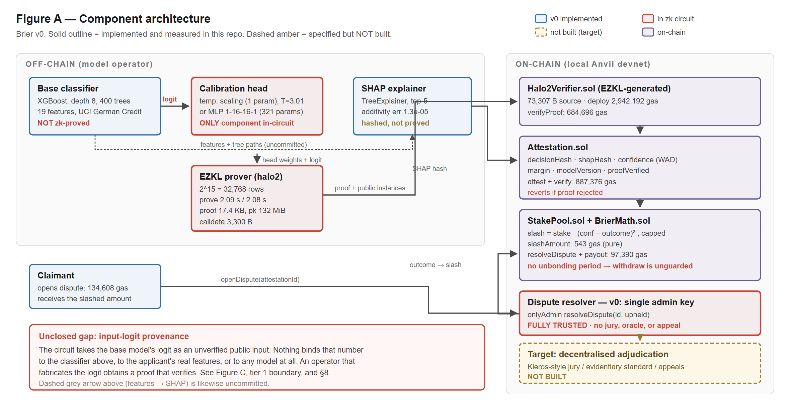
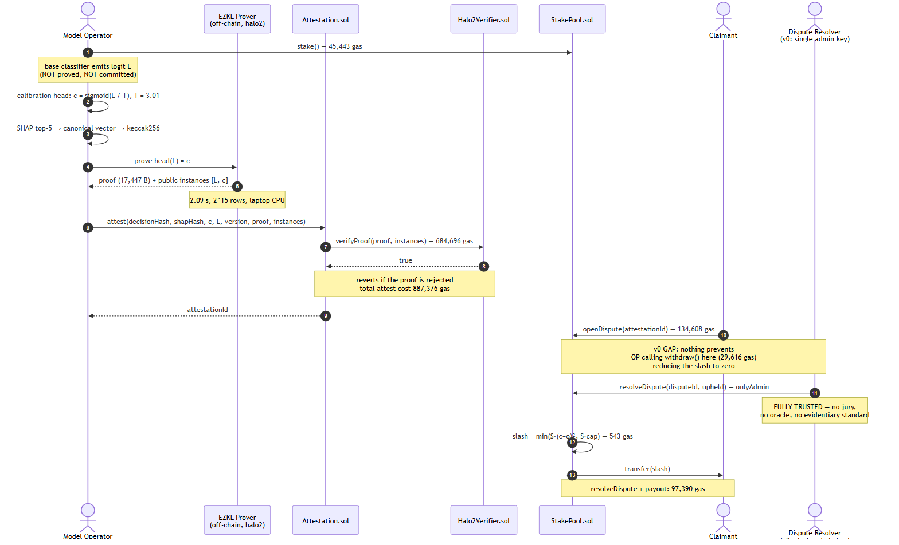
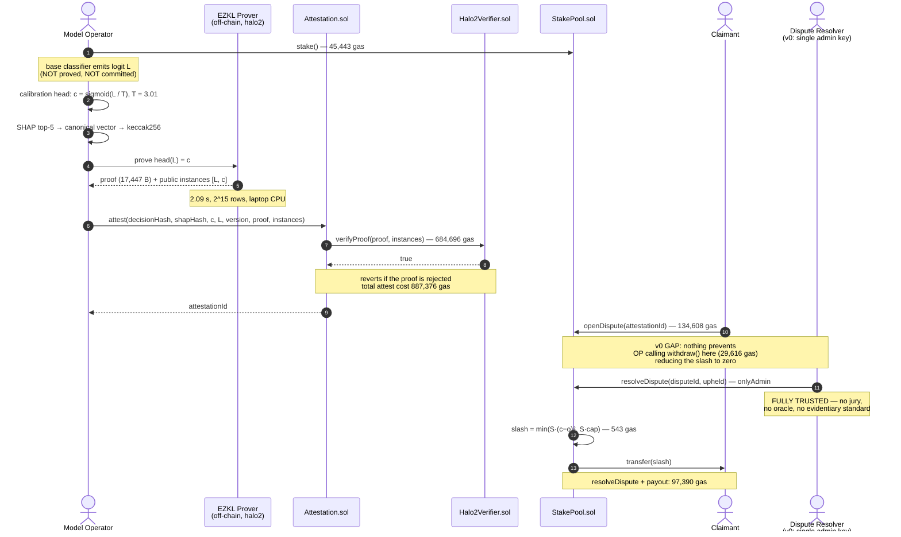
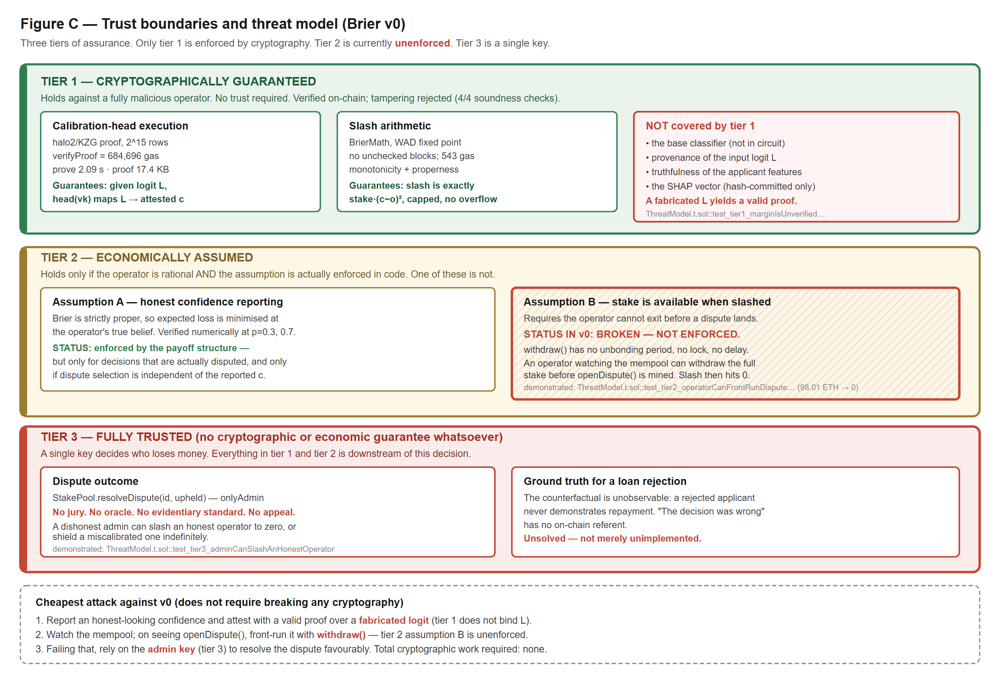
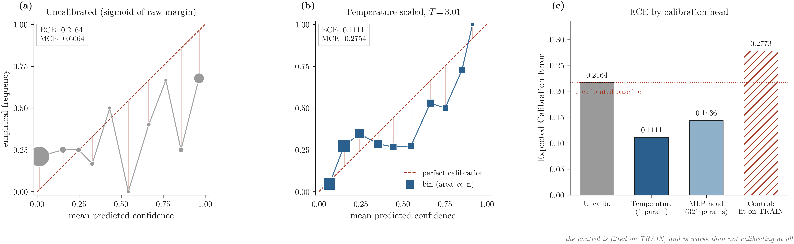
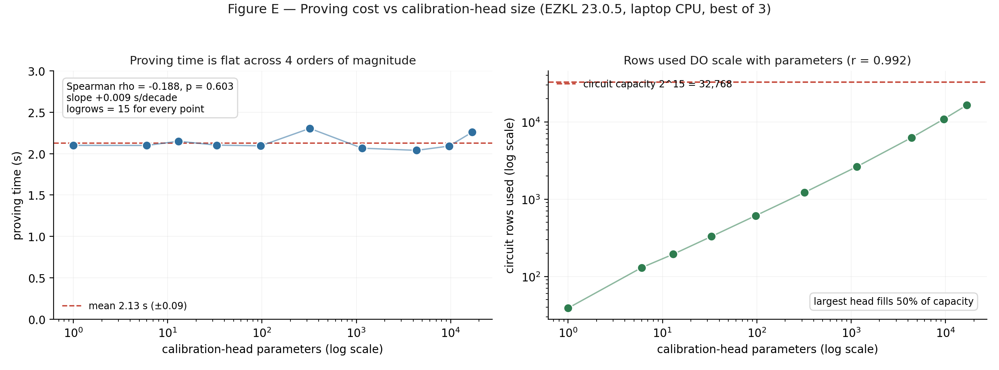

# Brier: Confidence-Calibrated Slashing for On-Chain AI Decision Accountability

**A research proposal with a measured v0 prototype**

Repository: <https://github.com/Sagexd08/Brier> · Version: v0 (prototype) · Date: August 2026

---

## Abstract

Accountability mechanisms for automated decisions penalise error at a
confidence-independent rate, so an operator is never punished for asserting 99%
confidence in a decision it believes at 60%. We propose slashing staked
collateral by the **Brier score** over (reported confidence, adjudicated
outcome). Because that score is strictly proper, expected loss is minimised
exactly when the operator reports its true subjective probability, making honest
confidence reporting loss-minimising rather than good faith. We report a measured
prototype: across 10 pinned seeds, temperature scaling cuts Expected Calibration
Error from 0.1853 ± 0.0248 to 0.0870 ± 0.0218 on held-out UCI German Credit data,
in every seed; an EZKL/halo2 circuit proves the calibration head in 2.09 s,
verified on-chain for 684,696 gas. This is a mechanism and a prototype, **not a
deployable protocol**: only the calibration head is proved and its input logit
is unverified, and dispute resolution rests on an admin-appointed N-of-M
committee whose collusion has exactly the power a single key had. An unbonding
period now closes the front-running exit that broke v0's economic tier, leaving
two residual gaps that a longer timelock cannot fix. The proposal states what
each remaining gap would take to close, and what evidence would settle whether
the mechanism survives contact with them. A subsequent pass ablated five
candidate enhancements against this baseline: conformal prediction earns a place
and fits the circuit budget at no measurable cost, while a deeper base model and
deep-ensemble epistemic uncertainty do not, the latter measurably degrading
calibration.

---

## 1. Introduction

### 1.1 The regulatory setting

Automated credit decisions are moving into a compliance regime that demands
records rather than assurances.

Under the EU AI Act, credit scoring is a high-risk application, and Article 26
places operational duties on **deployers** of such systems. Article 26(5)
requires deployers to "monitor the operation of the high-risk AI system on the
basis of the instructions for use" and to notify providers of risks or serious
incidents without undue delay. Article 26(6) requires deployers to "keep the
logs automatically generated by that high-risk AI system … for a period
appropriate to the intended purpose … of at least six months." Article 86
establishes a right to explanation of individual decision-making. Article 26
becomes applicable on 2 December 2027 for most high-risk systems, with an
extended deadline of 2 August 2028 for systems in employment, education, and
access to essential services [1].

These provisions mandate *logging and explanation*. They do not establish that
the logs are truthful, nor do they price the difference between a wrong decision
made tentatively and a wrong decision made with asserted certainty. A deployer
that logs a confidently wrong decision is compliant with Article 26(6).

**A note on the Indian setting, correcting a common assumption.** The RBI
Digital Lending Directions, 2025 are frequently cited as imposing algorithmic
transparency duties. They do not. The RBI Working Group recommended that
regulated entities "document the rationale for algorithmic features and conduct
regular algorithmic audits," but these recommendations were incorporated into
neither the 2022 Guidelines nor the 2025 Directions, which remain silent on
algorithmic fairness and transparency [2]. We therefore cite India as an example
of a **regulatory gap** rather than a regulatory driver. We were unable to
locate a provision in the 2025 Directions imposing model-explainability
obligations, and we do not assert one exists.

Regulation currently creates demand for *auditable records of automated
decisions*, and does not yet create demand for *calibrated confidence*. This
proposal argues that the latter is the more useful object; it does not claim
the latter is presently required.

### 1.2 The gap in existing mechanisms

Decentralised protocols already slash staked collateral for misbehaviour, and
already run decentralised claim adjudication. Neither weights the penalty by the
reporter's own stated confidence.

- **Oracle slashing.** Chainlink slashes node operators for failing on-chain
  service-level obligations at a **fixed 700 LINK per valid alerting event** on
  the ETH/USD data feed, with the alerter rewarded 7,000 LINK [3]. The penalty
  is a constant: it is identical whether the operator was marginally or
  egregiously wrong, and oracles do not report confidence at all.
- **Decentralised insurance.** Nexus Mutual resolves claims by stake-weighted
  member voting, with claim assessors staking NXM and rewarded for voting with
  the outcome [4]. The mechanism adjudicates *whether a claim is valid*; it does
  not score how confident anyone was.
- **On-chain proper scoring rules.** These do exist. Foresight Arena
  (arXiv:2605.00420) scores AI forecasting agents on Polymarket questions using
  the Brier score, with commitments and scores recorded on Polygon PoS via
  smart contracts [5].

The precise delta is therefore narrower than "nothing like this exists," and we
state it as such: **proper scoring rules have been applied on-chain to *reward*
forecasters in prediction-market settings; we are not aware of prior work
applying one to *slash staked collateral* of a model operator under dispute, with
the scored quantity produced by a zero-knowledge-proved calibration step.**
Foresight Arena is reward-based, involves no staked collateral at risk, no
slashing, and no zero-knowledge proofs [5]. We claim novelty in the combination,
not in any component.

### 1.3 Research questions

The proposal is organised around five questions. Each names the evidence that
would answer it; §6 reports how far the v0 prototype gets, and §8 proposes the
work that would close the remainder.

**RQ1 — Incentive.** Does penalising a disputed decision by its Brier score make
truthful confidence reporting the operator's loss-minimising strategy, and does
that property survive implementation in fixed-point on-chain arithmetic?
*Evidence:* an analytic derivation (§3.2), plus numerical verification of the
deployed Solidity against it (§5.7, §6.12).

**RQ2 — Feasibility.** Can the confidence-producing step be proved in zero
knowledge and verified on-chain at a cost a per-decision workflow could absorb?
*Evidence:* measured proving time, proof size, and verification gas (§6.3, §6.4).

**RQ3 — Cost structure.** How does proving cost scale with the size of the
proved head, and does that scaling favour proving a small calibration head over
a full classifier? *Evidence:* a parameter sweep across four orders of magnitude
(§6.3).

**RQ4 — Sufficiency.** Is a proved calibration head enough to make the resulting
attestation trustworthy? *Evidence:* an adversarial reading of the trust
boundary, with each claimed weakness executed as a test (§4.3, §7). The answer
established here is **no**, and that answer is what §8 is addressed to.

**RQ5 — Sophistication.** Does a more capable model, or a stronger uncertainty
quantifier, improve the quantity this mechanism actually prices? *Evidence:*
five enhancements ablated against the shipped baseline on the identical seed
protocol, each kept only if it earns its place (§6.5–§6.9, and `ABLATION.md`).

### 1.4 Contributions

1. A slashing rule built on a strictly proper scoring rule, with the properness
   argument derived in closed form (§3.2) and its scope conditions stated as
   part of the claim rather than as trailing caveats (§3.3).
2. A working implementation: fixed-point Brier arithmetic in Solidity at 543
   gas, an EZKL/halo2 circuit over the calibration head, and an attestation
   contract that rejects any decision whose proof does not verify.
3. A measured evaluation over 10 pinned seeds, including a leakage control that
   comes out *worse than not calibrating at all*, and a negative result on head
   capacity reported at the strength the data supports — a majority effect at
   $p = 0.037$, not the uniform one a single run would have suggested.
4. An adversarial trust model (§4.3) in which every asserted weakness is
   demonstrated by an executing test, so the threat model cannot drift from the
   code without the suite failing.
5. A conformal-prediction layer carrying a distribution-free coverage
   guarantee, shown by measurement to fit the existing circuit budget, and an
   ablation of four further enhancements of which two fail (§6.5–§6.9).
6. Two on-chain surfaces — an operator reputation register and a content-addressed
   model-version registry — each placed explicitly in the trust tier it actually
   occupies rather than the one its being on-chain might suggest (§4.3, §6.10).

---

## 2. Related work

### 2.1 zkML and verifiable inference

Verifiable inference asks a narrow question: given a committed model and an
input, can a party prove the output was computed correctly without revealing
the model, the input, or both? The field divides by proof system and by what
part of the pipeline is placed in circuit.

EZKL compiles computational graphs supplied in ONNX format into arithmetic
circuits and produces zk-SNARK proofs of correct model execution, using a
modified halo2 with Plonkish arithmetisation; anyone holding the verifying key
can check the proof [6]. This prototype uses EZKL 23.0.5 directly. Related
systems make different trade-offs along the same axis: zkCNN [11] specialises
the proof system to convolutional structure and obtains large constant-factor
gains at the cost of generality, while sumcheck-based approaches [12] target
asymptotically cheaper proving for layered arithmetic circuits. The common
finding across all of them is that cost tracks the proved subgraph, not the
model's accuracy or its business importance.

That finding is the design constraint this proposal is built around, and it
cuts in an unobvious direction. If proving cost scales with what is proved,
then the right question is not "how do we prove the model?" but "what is the
smallest computation whose correctness the mechanism actually needs?" For
confidence-calibrated slashing the answer is the calibration head — one
parameter — and §6.3 measures what that buys: cost flat across a 16,897×
parameter increase, because fixed lookup and column overhead dominate at these
sizes. The corollary, which §7.1 states as a limitation, is that everything
outside the proved subgraph is unbound, and the proposal is largely an argument
about how much that omission costs.

### 2.2 Decentralised oracle staking and slashing

Staking mechanisms bond a reporter's capital against its behaviour, and differ
in what triggers a loss and how large that loss is.

Chainlink's staking design uses on-chain service-level agreements, community
alerting, and fixed-size slashing penalties [3]. The size is the salient
detail: 700 LINK per valid alerting event on the ETH/USD feed, independent of
how wrong the feed was. This is a deliberate simplification — a constant
penalty needs no adjudication of degree — and it is exactly the property this
proposal replaces.

Nexus Mutual's claim assessment uses stake-weighted voting with a quorum,
escalation to a full member vote, and reward for majority-aligned voting [4].
Kleros provides general decentralised arbitration: jurors are drawn from PNK
stakers, self-select into sub-courts, vote on evidence, and are rewarded for
voting with the majority under a Schelling-point incentive, with appeals heard
by successively larger juries [7]. Both adjudicate a binary — was the claim
valid, did the defendant breach — and neither scores the reporter's confidence,
because in their settings the reporter does not state one.

The distinction worth drawing is between *slashing for misbehaviour* and
*scoring a forecast*. Slashing asks whether a rule was broken; scoring asks how
far a stated belief was from what happened. The literature is rich in the first
and, on-chain, nearly silent on the second. Kleros remains the most plausible
substitute for this prototype's committee (§8.2), and adopting it would inherit
a body of work on juror incentives that this proposal does not attempt to
reproduce.

### 2.3 Calibration in machine learning

A model is calibrated when its stated confidences match observed frequencies:
of the decisions it calls 80% likely, about 80% should hold. Accuracy and
calibration are independent — a model can be accurate and overconfident, or
inaccurate and perfectly calibrated — and this mechanism prices only the
second.

Guo et al. show that modern neural networks are poorly calibrated, that this
worsened as architectures grew, and that temperature scaling — a
single-parameter extension of Platt scaling dividing logits by a learned
$T > 0$ fitted on held-out data — is surprisingly effective at restoring it
[8]. Because the map is monotone it cannot change any decision, so calibration
is free in accuracy terms; §6.1 confirms accuracy is identical before and
after, as it must be.

Measurement is itself contested. Expected Calibration Error depends on a
binning scheme, and Nixon et al. show that equal-width binning is biased when
predictions cluster, proposing adaptive schemes that equalise bin population
[13]. This matters here more than usual, because ECE is not merely a reported
diagnostic — it is the quantity the mechanism's value proposition rests on. The
implementation is therefore explicit about its convention (§5.5) and is
known-answer tested; the sensitivity of the headline result to the binning
choice is not evaluated, and §7.6 records that as a limitation.

Temperature scaling is the primary method here for two reasons that happen to
agree: it is empirically strong on small calibration sets, and a
single-parameter affine map is the cheapest possible thing to arithmetise. §6.5
and §6.6 test whether more capable alternatives beat it, and find they do not.

### 2.4 Proper scoring rules

Brier introduced the mean-squared-error score for probability forecasts of
binary outcomes, in a meteorological setting where forecasters had every
incentive to hedge [9]. Gneiting and Raftery develop the general theory: a
scoring rule is *proper* if the forecaster maximises expected score by issuing
its true predictive distribution $F$ over any $G \neq F$, and *strictly proper*
if that maximum is unique [10]. They also give the Savage representation, under
which every proper scoring rule corresponds to a convex function of the
forecast, and the strictly proper rules to strictly convex ones — Brier
corresponding to $F(p) = p^2$.

Strict properness is the sole property this mechanism requires, and Brier is
not the only rule with it. The logarithmic score and the spherical score are
also strictly proper, and the log score has a stronger claim in information
theory, being the unique local proper rule [10]. Under a collateral constraint
the ranking inverts, for a reason that is specific to slashing rather than to
forecasting: the log score is unbounded, so it cannot be paid from a finite
stake, and truncating it destroys the very properness it was chosen for. §3.3
states and proves that failure, and it is the reason the choice of Brier is a
design decision rather than a default.

A separate strand applies proper scoring rules to elicit beliefs where no
ground truth will ever arrive — peer prediction and Bayesian truth serum
[14] — by scoring reports against other reports. That approach is
directly relevant to the unobservable-counterfactual problem of §7.2, and is
noted in §8.2 as an alternative to producing a ground truth that does not
exist.

### 2.5 Positioning

The delta is narrow and the table states it precisely. *Conf* = the penalty is
weighted by the reporter's own stated confidence; *Stake* = the reporter has
collateral at risk; *ZK* = the scored quantity is produced by a
zero-knowledge-proved computation; *Adjud.* = how the outcome is determined.

Table: Positioning against the mechanisms this work draws on. Feature
attributions are from the cited sources and describe those systems as
documented, not as re-implemented here.

| Work | Conf | Stake | ZK | Adjud. | Primary contribution |
|---|---|---|---|---|---|
| Chainlink staking [3] | – | yes | – | alerting | Fixed-size slashing on SLA breach |
| Nexus Mutual [4] | – | yes | – | member vote | Stake-weighted claim assessment |
| Kleros [7] | – | yes | – | juror pool | General decentralised arbitration |
| Foresight Arena [5] | yes | – | – | market | Brier-scored forecasting leaderboard |
| EZKL [6] | – | – | yes | – | ONNX-to-halo2 verifiable inference |
| This work | **yes** | **yes** | **yes** | N-of-M | Confidence-weighted slashing, measured |

No row is dominated on every axis, and the combination in the final row is what
is claimed as novel. Each component individually is prior art.

---

## 3. The mechanism

### 3.1 The slashing rule

:::definition Confidence-calibrated slash
Let $S$ be the collateral an operator has staked, $c \in [0,1]$ the confidence it
reported that its decision was correct, and $o \in \{0,1\}$ the adjudicated outcome
of a dispute over that decision. On an upheld dispute the contract slashes
$\text{slash} = S \cdot (c-o)^2$, subject to a protocol maximum fraction of $S$.
:::

The penalty is therefore the Brier score of a single forecast, denominated in
stake. Everything that follows depends on one property of that score and on
nothing else about it.

Table: Notation. Symbols are fixed here and used consistently throughout.
Values in the final column are those of the deployed prototype.

| Symbol | Meaning | Value |
|---|---|---|
| $S$ | operator collateral at stake | demonstration values |
| $c$ | reported confidence the decision was correct, in [0,1] | attested, WAD |
| $o$ | adjudicated outcome of a dispute, 0 or 1 | committee output |
| $p$ | operator's private belief that the decision is correct | unobservable |
| $L$ | base-model logit entering the calibration head | unverified input |
| $T$ | temperature of the calibration head | 3.47 ± 0.45 |
| $q$ | split-conformal quantile at level $\alpha$ | fitted off-chain |
| $\alpha$ | conformal miscoverage level | 0.05, 0.10, 0.20 |
| $vk$ | halo2 verifying key identifying the proved head | one per version |
| $\tau$ | unbonding delay before a withdrawal may execute | 7 days (floor 1 h) |
| $N/M$ | resolver threshold over committee size | 2 of 3 |

### 3.2 Why truthful reporting minimises expected loss

:::assumption Truthful adjudication
The operator privately believes the decision is correct with probability $p$. A
dispute, if opened, is adjudicated truthfully, so $o = 1$ with probability $p$;
and the decision to open a dispute is independent of the reported $c$.
:::

:::proposition Strict properness of the Brier slash
Under Assumption 1, an operator reporting $c$ faces expected slash
$E[\text{slash}] = S ( (c-p)^2 + p(1-p) )$. This is uniquely minimised at
$c = p$, and every misreport costs $S(c-p)^2$ in expectation.
:::

:::proof
The dispute is upheld with probability $p$, in which case $o = 1$ and the slash
is $S(c-1)^2$; otherwise $o = 0$ and the slash is $Sc^2$. Hence
$E[\text{slash}] = S ( p(c-1)^2 + (1-p)c^2 ) = S ( c^2 - 2pc + p )$.
Completing the square in $c$ gives $S ( (c-p)^2 + p(1-p) )$. The bracket is a
strictly convex parabola in $c$ whose only stationary point is $c = p$, and the
residual $p(1-p)$ does not depend on $c$, so the minimum is unique and the
excess cost of reporting $c \neq p$ is exactly $S(c-p)^2$.
:::

Two consequences follow, and together they are the whole argument.

**The unique minimum is at $c = p$.** The expression is a strictly convex
parabola in $c$, so any misreport in either direction costs the operator
$S(c-p)^2$ in expectation. Overclaiming confidence is not merely unrewarded, it
is priced quadratically, so shading the truth slightly is cheap
while asserting near-certainty about a coin flip costs close to the entire stake.
This is strict properness [10] instantiated as a collateral rule: the operator
does not need to be honest, it needs only to be selfish.

:::corollary Uncertainty is priced, and separately from dishonesty
The residual $S \cdot p(1-p)$ is irreducible: it is incurred whatever the
operator reports, and is maximised at $p = 0.5$.
:::

An operator facing genuine uncertainty pays for it however honestly it
reports. That is the economically correct reading: the term is the price of
writing an opinion on a hard case. The mechanism therefore separates the cost
of *being uncertain* from the cost of *misrepresenting uncertainty*, and only
the second is avoidable by the operator — which is precisely the behaviour a
slashing rule should reward.

The deployed contract computes this in fixed point rather than over the reals, so
properness is re-established empirically against the shipped code rather than
inherited from the algebra: §5.7 scans all 101 candidate reports at two distinct
true probabilities and confirms the expected-loss minimiser is the true one in
both, and monotonicity is fuzzed at 256 runs per direction.

### 3.3 Why the Brier score, and why the cap must be 100%

Brier is not the only strictly proper scoring rule, and the choice among them
is usually treated as a matter of taste. Under a collateral constraint it is
not: boundedness stops being an aesthetic property and becomes the difference
between a mechanism that works and one that cannot be implemented.

The logarithmic score $-\log c$ (on $o = 1$) is strictly proper and is the
standard alternative. It is also unbounded as $c \to 0$, so a slash defined
from it is unbounded, and no finite stake can cover it. Any implementation must
therefore truncate it — and truncation is exactly what the next result shows to
be fatal. The spherical score is bounded but has no natural scale in units of
stake. Brier is the proper rule whose range is already $[0,1]$, so
"slash the whole stake" and "the worst possible score" coincide, and the
cap never has to bind.

That last point is usually stated as a convenience. It is a correctness
requirement.

:::proposition Capping the slash destroys strict properness
Let the contract slash $S \cdot \min((c-o)^2, \kappa)$ for a cap
$\kappa \in (0,1]$. Truthful reporting minimises expected loss if and only if
$\kappa \geq \max(p, 1-p)$. For $\kappa < \max(p, 1-p)$ the unique minimiser is
a boundary report: $c = 0$ when $p < 1/2$, and $c = 1$ when $p > 1/2$.
:::

:::proof
Write $E(c)$ for the expected slash in units of $S$. Truthful reporting yields
$E(p) = p(1-p)$, provided neither branch is capped at $c = p$. The two boundary
reports yield $E(0) = p \cdot \min(1, \kappa) = p\kappa$ and
$E(1) = (1-p) \kappa$, since $\kappa \leq 1$.

Comparing, $E(0) < E(p)$ exactly when $p\kappa < p(1-p)$, that is when
$\kappa < 1-p$; and $E(1) < E(p)$ exactly when $\kappa < p$. So the truthful
report is beaten by some boundary report precisely when
$\kappa < \max(p, 1-p)$, and survives otherwise. Since
$\max(p, 1-p) \geq 1/2$, any cap below one half breaks properness at every
$p \neq 1/2$. At $\kappa = 1$ the constraint $\kappa \geq \max(p,1-p)$ holds for
all $p$, the caps never bind, and Proposition 1 applies unchanged.
:::

The direction of the failure is what makes this worth stating. A cap does not
merely weaken the incentive; it inverts it. Capped liability protects the
operator from the worst outcome of an extreme report, so extreme reports become
cheap, and the mechanism starts paying for exactly the overconfidence it was
built to price. This is the familiar risk-shifting effect of limited liability,
arriving through a parameter that looks prudential.

The practical consequence is a deployment rule. `maxSlashBps` must be 10,000,
and it is: `test_cap_atOneHundredPercent_preservesProperness` confirms the
minimiser is the true probability at four values of $p$, while
`test_cap_belowHalf_rewardsMaximalOverconfidence` shows a 50% cap sending an
operator to $c = 0$ or $c = 1$, and
`test_cap_propernessHoldsExactlyOnTheInterval` pins the boundary at
$\kappa = 0.75$. An operator lowering the cap to reduce exposure would silently
convert the protocol into one that rewards the behaviour it exists to punish,
so the constraint is enforced by a red test suite instead of a comment.

### 3.4 What the mechanism requires, and where else it applies

Definition 1 is stated over a (confidence, outcome) pair and a stake. Nothing in
it mentions credit, and the properness argument of §3.2 uses no property of the
decision beyond the three the definition names. It is therefore worth separating
what the mechanism needs from what this particular deployment happens to supply.

The mechanism requires exactly three things:

1. **A scalar confidence** the operator commits to before the outcome is known.
2. **A binary outcome** that is eventually adjudicated.
3. **Collateral** the operator loses access to while a decision is disputable.

Any setting supplying those three admits the same rule, and the properness
argument transfers unchanged. Candidate settings, in decreasing order of fit:

- **Price and data oracles.** Reporters already stake, and already have a
  natural notion of being wrong. What they do not currently do is report
  confidence at all (§1.2), which is a reporting-format change rather than a
  mechanism change. The outcome is observable, which removes the hardest
  problem this proposal has (§7.2).
- **Model marketplaces and inference markets.** A served prediction with an
  attached confidence, an escrowed bond, and a later ground-truth reveal is
  structurally identical to the credit case, with the advantage that the
  counterfactual is usually observed.
- **Automated underwriting and claims triage.** Same shape as credit, same
  unobservable-counterfactual problem for declines.
- **Agent action markets.** An agent that commits to a confidence before taking
  a consequential action fits the definition, but "the action was wrong" is
  frequently not binary, which breaks requirement 2.

The setting that does **not** fit, and which we flag because it is the one most
often assumed to: free-form generation. It has no canonical scalar confidence,
no binary ground truth, and no stable notion of the same decision across
sampling seeds (§8.4).

Credit scoring was selected as the instantiation for three reasons: the
regulatory pressure is concrete (§1.1), a standard public dataset exists, and
the counterfactual problem is at its *hardest* there. A mechanism that survives
the rejection case is not made worse by settings where outcomes are observed;
the converse would not hold.

### 3.5 Scope conditions, stated as part of the claim

The derivation assumes the adjudicated outcome is truthful and that dispute
selection is independent of the reported confidence. Neither condition is
guaranteed by this prototype. Specifically:

1. **Input-logit provenance is unproven.** The circuit takes the base model's
   logit as an unverified public input. An operator that fabricates the logit
   obtains a proof that verifies. The proof binds the calibration step, not the
   pipeline (Figure 3, tier 1; `ThreatModel.t.sol::test_tier1_marginIsUnverifiedOperatorSuppliedInput`).
2. **Off-chain misreporting before proving is not prevented.** Nothing forces
   the operator to feed the circuit the logit its deployed model actually
   produced.
3. **Selective disputes break the properness argument.** If only rejections are
   ever disputed, the operator faces an asymmetric loss surface, and the
   dominant strategy under that surface is not analysed here.

The mechanism is proper; the *system* is proper only insofar as these
conditions hold, and in v0 they do not. Closing conditions 1 and 3 is the
substance of the proposed work in §8.

---

## 4. System design

### 4.1 Components and where the circuit sits



The base classifier and the SHAP explainer sit outside the circuit by design:
the vector they produce is hash-committed as evidence, which establishes that
the operator recorded a particular explanation and nothing about whether that
explanation is faithful.

### 4.2 Protocol sequence and per-step cost

The sequence below is annotated with the gas each step actually cost on a local
chain, so the expensive steps are visible rather than asserted: verification
dominates, and the Brier arithmetic that is the substance of the mechanism is
three orders of magnitude cheaper than proving that it ran. The diagram also marks the
one step the mechanism still cannot enforce against: resolution is a committee
action, so a penalty the contract computes correctly can be waived by the people
who resolve it (§7.2).





### 4.3 Trust boundaries



This is the diagram against which every other claim in this document should be
checked. Three tiers:

- **Tier 1 (cryptographically guaranteed, green).** Calibration-head execution
  and the slash arithmetic. Holds against a fully malicious operator.
- **Tier 2 (economically assumed, amber).** Assumption A (honest confidence
  reporting) is enforced by the payoff structure, conditionally. Assumption B
  (stake is available when slashed) was **broken in v0** and is now enforced:
  withdrawal is a two-step request/execute with an unbonding delay, and any open
  dispute freezes execution (§7.3). Two residual gaps remain, and neither is a
  timelock bug.
- **Tier 3 (bounded trust, red).** Dispute outcome and ground truth. An
  admin-appointed N-of-M committee decides who loses money; N colluding members
  can decide it arbitrarily. The tier keeps its colour — it is a smaller red
  region, not a different one.

Each weakness in the figure names the test that demonstrates it. The cheapest
attack path still requires no cryptographic work: fabricate the logit, since
tier 1 does not bind it (`test_tier1_marginIsUnverifiedOperatorSuppliedInput`),
or corrupt N committee members, which
`test_tier3_nOfMCollusionHasSameEffectAsV0Admin` shows buys exactly the power
v0's single key had.

### 4.4 Calibration reliability



Bin values are read directly from `artifacts/calibration/phase1_report.json`; no
curve is fitted or smoothed. Left: uncalibrated, ECE 0.2164, with a bin at mean
confidence 0.5430 whose empirical frequency is 0.0000. Centre: after temperature
scaling with $T = 3.01$, ECE 0.1111. Right: ECE across heads, including the
leakage control described in §5.2.

---

## 5. Methodology

### 5.1 Dataset and model

UCI Statlog German Credit: 1,000 real credit applications, 20 attributes,
downloaded at build time. The label is inverted so that the positive class is
*reject*. Attribute 9 (personal status and sex) is dropped, leaving 19 features
(see §7.4). Split 60/20/20 into train (600) / calibration (200) / test (200),
stratified, seed 42, with mutual disjointness asserted in code.

The base model is XGBoost (depth 8, 400 trees, learning rate 0.3, no
regularisation) and is **deliberately overfit**: train accuracy 1.0000, test
accuracy 0.7150. This is a methodological choice, not a tuned result.
Demonstrating a calibration-insurance mechanism on an already-calibrated model
would establish nothing; the overfit regime reproduces the overconfidence that
makes calibration worth insuring. The base model's accuracy is not a claim of
this work.

### 5.2 Calibration

Two heads were implemented and both are proved:

Table: The two calibration heads. Both emit a logit, so the circuit stays affine plus ReLU and contains no transcendental function.

| Head | Parameters | Form |
|---|---|---|
| Temperature scaling | 1 | $\sigma(L/T)$, $T$ learned in log-space |
| MLP | 321 | $1 \to 16 \to 16 \to 1$, ReLU |

Both emit a **logit**, with the sigmoid applied outside the module, so the
circuit is affine + ReLU only and contains no transcendental function.

Both are fitted on the **calibration split only**. To show this matters rather
than assert it, every run includes a control that fits the same head on the
*training* split: that control yields $T = 0.1344$ and test ECE 0.2773, which is
**worse than not calibrating at all** (0.2164). Fitting on training data
*sharpens* an already-overconfident model.

### 5.3 Uncertainty quantification beyond a point estimate

Temperature scaling returns a calibrated scalar with no guarantee attached. Two
stronger constructions were implemented and evaluated against it.

**Split conformal prediction** [16, 17] returns a *set* carrying a distribution-free
marginal coverage guarantee: over the joint draw of calibration and test data,
the true label lies in the set at least $1-\alpha$ of the time, with no
assumption that the model is correct or even well specified. The calibration
split is halved so the temperature and the conformal quantile never see the same
points — reusing one split for both would break the exchangeability the
guarantee rests on. Results in §6.5.

**Deep-ensemble epistemic uncertainty** [18] trains $N$ independently seeded copies of
the neural base model and feeds the spread of their predictions to the
calibration head alongside the margin, on the intuition that a confident score
the members disagree about should be discounted. Results in §6.6, where that
intuition does not survive measurement.

### 5.4 Explainability

SHAP [19] TreeExplainer over the base model, top-5 attributions per decision, in
margin space. Correctness is checked by additivity (SHAP values plus base value
must reconstruct the model margin; measured max absolute error
$1.26 \times 10^{-5}$) and by bit-identical reproduction across reruns. Five
directional claims, written before inspecting output, are verified by
correlating each feature's value against its attribution toward reject.

**Counterfactual explanations.** SHAP answers "what drove this decision"; an
applicant reading an adverse action notice is asking "what would change it".
Those are different questions, and the second is the actionable one. A greedy
coordinate search over *actionable* features produces a minimal-ish change set
that flips a rejection, restricted to values the training data actually
contains. Immutable attributes — age, foreign-worker status, dependants — are
excluded by construction and the exclusion is asserted rather than assumed.
The counterfactual is hash-committed alongside the SHAP vector, in the same
evidence slot and at the same trust tier: it is proof the operator recorded
this explanation, not proof the explanation is faithful. Results in §6.7.

### 5.5 Evaluation metrics

ECE is the headline metric and the quantity the mechanism's value rests on, so
its definition is given explicitly rather than by reference — the binning
convention is exactly what a reviewer needs to audit, and different conventions
give materially different numbers [13].

:::definition Expected Calibration Error
Partition $[0,1]$ into $B$ equal-width bins. For predictions $\hat{p}_i$ with
outcomes $y_i$, let $I_b$ index the predictions falling in bin $b$. Then
$\text{ECE} = \sum_b \frac{|I_b|}{n} | \text{acc}(I_b) - \text{conf}(I_b) |$,
where $\text{conf}(I_b)$ is the mean prediction in the bin and
$\text{acc}(I_b)$ the empirical frequency of $y = 1$ within it.
:::

Three conventions are fixed, each of which changes the number:

1. $B = 10$, equal width, bins left-open and right-closed except the first,
   which includes 0.
2. Bins are weighted by population, so a bin holding two points cannot move
   the result as much as one holding two hundred.
3. **Empty bins are skipped, not counted as perfectly calibrated.** Counting
   them as zero-error would reward a model that concentrates its predictions
   into a narrow range, which is the opposite of what the metric should do.

Maximum Calibration Error is the same quantity under a max rather than a
weighted mean, and is reported alongside because it exposes a single badly
miscalibrated bin that ECE averages away. The Brier score needs no binning and
is the quantity the mechanism actually charges, which makes it the least
arbitrary of the three; it is decomposable into calibration and refinement
terms, and only the first is what this proposal prices.

The implementation is known-answer tested against hand-computed values
(`tests/test_metrics.py`), because a silently wrong ECE would invalidate every
calibration claim in §6 without failing anything.

### 5.6 Systems measurements

Beyond calibration: proof generation time (best of three runs, to suppress
scheduler noise), proof size in bytes, calldata per attestation, proving-key
size, native verification time, and on-chain verification gas. Circuit shape is
recorded as `logrows` together with rows actually used, since the two diverge
and only the first determines cost (§6.3).

### 5.7 Slashing validation

Monotonicity in miscalibration is verified deterministically at 101 confidence
points and by fuzzing (256 runs per direction). Properness is verified
numerically by scanning all 101 candidate reports at two distinct true
probabilities, $p = 0.30$ and $p = 0.70$, and confirming the expected-loss
minimiser equals $p$ in both cases. Four scenarios are then run end-to-end on a
local chain (§6.4).

---

## 6. Results

All figures below are produced by scripts in the repository. Environment:
Windows 11, Python 3.13.5, xgboost 3.1.2, torch 2.9.1+cpu, EZKL 23.0.5,
Foundry 1.7.1, laptop CPU, no GPU. Seed 42.

### 6.1 Calibration

The calibration claims rest on the 10-seed pass. Seeds are pinned in
`config.EVAL_SEEDS` and the full list is always run, so a favourable subset
cannot be reported selectively.

Table: Calibration across the 10 pinned seeds. Temperature scaling reduces ECE in every seed; the train-fitted control is worse than not calibrating in every seed.

| Head | ECE mean ± std | Brier mean ± std | Accuracy mean ± std |
|---|---|---|---|
| Uncalibrated | 0.1853 ± 0.0248 | 0.2060 ± 0.0191 | 0.7505 ± 0.0209 |
| **Temperature (1 param)** | **0.0870 ± 0.0218** | **0.1758 ± 0.0113** | 0.7505 ± 0.0209 |
| MLP (321 params) | 0.1055 ± 0.0234 | 0.1908 ± 0.0119 | 0.7330 ± 0.0199 |
| *Control: fitted on TRAIN* | *0.2434 ± 0.0212* | — | — |

Learned $T = 3.4657 \pm 0.4491$, with $T > 1$ in **every** seed — the base model
required softening everywhere, never sharpening. Temperature scaling reduces ECE
in **every** seed, and the train-fitted control is worse than not calibrating at
all in **every** seed (paired Wilcoxon $p = 0.002$, the minimum attainable at
$n = 10$). Accuracy is unchanged by temperature scaling, as it must be: a
monotone rescaling of the logit cannot move the decision boundary. Calibration
buys a better-priced confidence, not a better classifier, and the table separates
the two.

**Negative result on head capacity, reported at the strength the data supports.**
The 321-parameter MLP head does not beat the 1-parameter head. Across the 10
pinned seeds temperature scaling has the lower ECE in **7 of 10** — paired
Wilcoxon $W = 7.0$, $p = 0.037$, median difference $-0.018$. This is a *majority*
result, not a uniform one, and it is stated that way deliberately: a single run
per head would have supported the stronger and less accurate claim. With 200
calibration points the extra capacity usually fails to generalise, but in 3 of 10
seeds the MLP wins. The reported strength is pinned by
`test_temperature_beats_mlp_claim_matches_reported_strength`,
so overstating it later would fail the suite. The convenient part of this result
is that the better estimator is also the cheaper circuit; that agreement is a
measured outcome rather than a design assumption.

**Seed-selection audit.** Because a single seed can be chosen after the fact, we
report where ours falls. Seed 42 ranks 6th of 10 by ECE reduction (48.7% against
a 52.8% mean) while carrying the *highest* uncalibrated ECE of any seed — the
single-seed figures are therefore pessimistic in absolute terms and middling in
relative terms. `SEED = 42` was committed once, before any result existed, and
never changed; the repository contains no notebooks.

**Seed 42 in detail**, since it is the seed the figures, circuits and end-to-end
run are generated from:

Table: Seed 42 in detail, the seed from which the figures, circuits and end-to-end run are generated.

| Head | Params | ECE | MCE | Brier |
|---|---|---|---|---|
| Uncalibrated | — | 0.2164 | 0.6064 | 0.2353 |
| **Temperature scaling** | 1 | **0.1111** | 0.2754 | 0.1897 |
| MLP | 321 | 0.1436 | 0.7766 | 0.2030 |
| *Control: temperature fitted on TRAIN* | 1 | *0.2773* | — | — |

Learned $T = 3.0121$; base accuracy train 1.0000, test 0.7150. Figure 4 plots
the left two columns of this table as reliability curves.

### 6.2 Explainability

Additivity max absolute error $1.26 \times 10^{-5}$; attributions bit-identical
across 3 reruns; 5/5 directional sanity checks pass
(`installment_rate_pct_income` $+0.621$, `duration_months` $+0.505$,
`credit_history` $-0.756$, `checking_status` $-0.943$, `savings_status` $-0.834$).

### 6.3 Proving and verification

Table: Proving and verification cost for the two heads. A 321x parameter increase changes neither the circuit size nor the proving time.

| Metric | Temperature (1 param) | MLP (321 params) |
|---|---|---|
| Circuit size | $2^{15}$ = 32,768 rows | $2^{15}$ = 32,768 rows |
| Proving time | **2.09 s** | **2.08 s** |
| Native verification | 0.094 s | 0.058 s |
| Keygen | 1.86 s | 2.03 s |
| Proof size | 17,447 B | 17,566 B |
| Proving key | 132 MiB | 132 MiB |
| Calldata per proof | 3,300 B | 3,300 B |
| Tamper-soundness | 4/4 rejected | 4/4 rejected |

**Proving cost is invariant to a 16,897× parameter increase.** A 10-point sweep
from 1 to 16,897 parameters holds `logrows` = 15 at every point. Rows used scale
linearly with parameter count (slope 0.98 rows/param, $r = 0.992$) but proving
time does not follow it: mean 2.13 s, standard deviation 0.09, regression slope
+0.009 s per decade of parameters, Spearman rank correlation $-0.188$ at
$p = 0.603$ — indistinguishable from no relationship. Fixed lookup-argument and
column overhead dominate the multiply-accumulate count entirely. This is the
answer to RQ3, and it is the reason the design proves a head rather than a
classifier: within the circuit's capacity, a larger head is very nearly free,
so the binding constraint is capacity, not parameter count.

**Scope limit.** This holds *within* logrows = 15. The largest head fills 16,511
of 32,768 rows (50.4%), so the sweep does not cross the capacity boundary; where
cost steps at logrows 16+ is **unmeasured**. The claim is "flat until the head
stops fitting the circuit," not "flat without limit."



Soundness is tested, not assumed: an honest proof verifies, while a
tampered public output, a flipped byte at the proof head, a flipped byte
mid-proof, and a wrong verifying key are each rejected.

### 6.4 On-chain cost and end-to-end behaviour

Table: Measured gas per operation. Verification dominates; the Brier arithmetic that is the substance of the mechanism is roughly 0.08% of the per-decision cost.

| Operation | Gas |
|---|---|
| `Halo2Verifier` deployment (one-off) | 2,942,192 |
| `verifyProof` (real EZKL proof) | **684,696** |
| `attest` (verify + store) | 887,376 |
| `openDispute` | 134,608 |
| `resolveDispute` incl. slash + payout | 97,390 |
| `stake` | 45,443 |
| `withdraw` | 29,616 |
| `BrierMath.slashAmount` (pure) | 543 |

Verification is ~33× a plain 21,000-gas transfer. The Brier arithmetic is 543
gas — approximately 0.08% of the per-decision cost. **Essentially all cost is
halo2 verification, not the mechanism.**

End-to-end, on a local Anvil chain, with a real proof generated per decision:

Table: End-to-end behaviour on a local chain, one real zk proof generated per decision. Percentages are of the stake remaining as each scenario ran.

| Scenario | Confidence | Outcome | Slash (% of stake) | Prove |
|---|---|---|---|---|
| (a) confident + correct | 0.9845 | upheld | **0.0239%** | 2.24 s |
| (b) confident + wrong | 0.9367 | overturned | **87.7458%** | 2.25 s |
| (c) uncertain + wrong | 0.5012 | overturned | **25.1173%** | 2.06 s |

Ordering holds: (b) > (c) > (a). Confident-and-wrong costs 3,667× confident-and-correct
and 3.49× uncertain-and-wrong. Percentages are of the stake remaining when each
scenario ran — the three execute sequentially against one shrinking stake, so the
percentage column is the comparable one and absolute ETH values across rows are not.

**These figures are now enforceable against the operator, which was not true in
v0.** The earlier exit path — front-running `openDispute()` with an instant
`withdraw()` — reduced every slash in this table to zero. Withdrawal is now a
two-step request/execute separated by an unbonding delay, and an open dispute
freezes execution, so
`ThreatModel.t.sol::test_tier2_frontRunDisputeByWithdrawing_isNowBlocked`
asserts the attack fails and is the standing regression test for it. What the
table still does not survive is a dishonest committee: resolution is a tier-3
action, so the figures describe what the mechanism computes and enforces against
the *operator*, not what it enforces against its own resolvers (§7.2, §7.3).

### 6.5 A deeper base model does not help (Phase A)

An entity-embedding neural network over the same 19 features, and its ensemble
with XGBoost, were evaluated on the identical 10-seed protocol. The XGBoost arm
reproduces §6.1 exactly, which is the check that the protocol is the same one
rather than merely a similar one.

Table: Phase A. The ensemble improves uncalibrated ECE and temperature scaling then absorbs the difference entirely.

| Model | Uncalibrated ECE | Calibrated ECE | Calibrated Brier | Accuracy |
|---|---|---|---|---|
| XGBoost (baseline) | 0.1853 ± 0.0235 | 0.0870 ± 0.0207 | 0.1758 ± 0.0107 | 0.7505 ± 0.0198 |
| Tabular NN | 0.2419 ± 0.0189 | 0.0874 ± 0.0226 | 0.1843 ± 0.0071 | 0.7280 ± 0.0187 |
| Ensemble | 0.1617 ± 0.0181 | 0.0834 ± 0.0154 | 0.1733 ± 0.0091 | 0.7410 ± 0.0164 |

**Null result.** On calibrated ECE the ensemble wins 6 of 10 seeds
($p = 0.6953$) and the NN alone 5 of 10
($p = 0.9219$) — neither distinguishable from chance. On accuracy the
ensemble *loses*, 2 of 10 ($p = 0.1953$). It is not adopted.

The informative part is where the gain goes. The ensemble clearly improves
*uncalibrated* ECE (0.1617 against
0.1853), and temperature scaling then absorbs the
whole difference. **Ensembling and calibration are substitutes here, not
complements.** Since the ensemble costs an entire second model family and
calibration costs one parameter, this is an argument for the one-parameter head
rather than against sophistication in general.

### 6.6 Epistemic uncertainty makes calibration worse (Phase C)

5 independently seeded network copies; disagreement is the standard
deviation of member probabilities, supplied to the head alongside the margin.

Table: Phase C. The capacity control is the informative row: the same head fed a constant beats the baseline, so the epistemic signal is what destroys the gain.

| Arm | ECE | Brier | Accuracy |
|---|---|---|---|
| Temperature (baseline, 1 param) | 0.0870 ± 0.0207 | 0.1758 ± 0.0107 | 0.7505 ± 0.0198 |
| Margin + disagreement | 0.1072 ± 0.0324 | 0.1916 ± 0.0174 | 0.7295 ± 0.0294 |
| Margin + constant (capacity control) | 0.0743 ± 0.0170 | 0.1757 ± 0.0109 | 0.7530 ± 0.0165 |

**Negative result, and the control is what makes it legible.** The epistemic
signal *degrades* calibration: 2W/8L against the baseline,
median +0.01611, $p = 0.1309$. But the same two-input head
shape fed a *constant zero* in place of the signal beats the baseline —
8W/2L, median -0.01238, $p = 0.0371$.

So the architectural change helps slightly and the epistemic signal then destroys
that gain. Without the control this would have read as "ensemble disagreement
doesn't help"; with it, the finding is sharper and less comfortable — the signal
is **noise that the head overfits** on 200 calibration points. The cost is not
close either: 5 model copies at 54 s
per seed, roughly ten times the baseline, to make calibration worse.

The wider lesson is about experimental design more than about ensembles. Had
the control been omitted, the arms would have read as "epistemic uncertainty
does not help", and the true effect — that the architecture helps while the
signal cancels it — would have been invisible. Any ablation that adds capacity
and a feature simultaneously needs the capacity-only arm to be interpretable.

### 6.7 Conformal prediction, and its circuit cost (Phase B)

Empirical coverage across the pinned seeds, at three levels:

Table: Phase B. Coverage tracks the target and sits 1-2 points below it at every level, within sampling noise at n = 10.

| Target | Empirical coverage | Min over seeds | Seeds ≥ target | Avg set size |
|---|---|---|---|---|
| 0.80 | 0.7930 ± 0.0399 | 0.7300 | 5/10 | 1.102 |
| 0.90 | 0.8815 ± 0.0408 | 0.8200 | 4/10 | 1.357 |
| 0.95 | 0.9335 ± 0.0398 | 0.8550 | 4/10 | 1.570 |

Coverage tracks the target and sits 1–2 points below it at every level. At
$n = 10$ the shortfall is within sampling noise, so this is **not** reported as a
violated guarantee — nor as confirmation. The likely cause is that the
three-way split is stratified, which mildly breaks the exchangeability conformal
assumes; on genuinely iid synthetic draws the implementation does meet its
target (`tests/test_conformal.py`). Set size is reported alongside coverage
because coverage alone is trivially satisfiable: always return both labels and
you have 100% coverage and no information.

**The circuit gate, measured, not argued.**

Table: Phase B circuit gate. Conformal set construction fits the established budget at no measurable proving cost.

| Head | logrows | Rows used | Proving time | Proof size |
|---|---|---|---|---|
| Temperature only | 15 | 39 | 1.72 s | 17,525 B |
| Temperature + conformal | 15 | 95 | 1.66 s | 17,828 B |

It fits inside the established logrows = 15 budget, adding
56 rows of 32,768 and no measurable proving time.
The reason is that both comparisons push through the monotone sigmoid into logit
space and become comparisons against two constants — so the sigmoid never enters
the circuit and the head stays affine. Conformal set construction is therefore
**promoted to tier 1**, proved on the same terms as the confidence itself.

Two things this does not buy, stated because they are easy to overstate. The
quantile $q$ is not computed in-circuit: that needs a sort over calibration
scores and it is a per-deployment constant, so it is fitted off-chain and
committed exactly as $T$ is — its provenance is exactly as unproven as $T$'s.
And the coverage guarantee is *marginal*: a conformal predictor can hit 90%
overall while covering a protected subgroup at 60%, which is the same limitation
aggregate ECE has (§7.4).

### 6.8 Counterfactual evidence (Phase D)

Table: Phase D. Counterfactuals over 40 rejections, checked for actionability and plausibility.

| Metric | Value |
|---|---|
| Rejections examined | 40 |
| Counterfactual found | 40 (100%) |
| Mean changes when found | 1.075 |
| Immutable-attribute violations | 0 |
| Implausible (unobserved) values | 0 |
| Mean overlap with SHAP top-5 | 0.762 |
| Hash reproduces on rerun | True |

The plausibility check earned its place on the first run, which flagged 10 of 40
cases: quantile-derived candidate values are interpolated, so the search was
proposing loan amounts occurring nowhere in the data. "Reduce the loan to
3,271 DM" is not an actionable instruction when no such loan exists, and
candidates are now snapped to observed values. The 0.762
overlap with the SHAP top-5 is a consistency check on the bundle, since the two
explanations are committed together and routine disagreement would make the
evidence internally inconsistent. The search is greedy, so what is reported is
sparsity, not minimality.

### 6.9 Collusion detection, on synthetic rings only (Phase E)

A two-hop GraphSAGE classifier over the claimant projection of the dispute
graph, against a degree-concentration baseline. Intensity is the fraction of a
ring member's disputes aimed at the ring's operator.

Table: Phase E. Detection against injected rings only; intensity is the fraction of a ring member's disputes aimed at its own operator.

| Ring intensity | GNN AUC | Degree-baseline AUC |
|---|---|---|
| 1.00 | 1.000 ± 0.001 | 0.984 ± 0.009 |
| 0.85 | 0.980 ± 0.013 | 0.958 ± 0.014 |
| 0.70 | 0.884 ± 0.097 | 0.865 ± 0.102 |
| 0.60 | 0.856 ± 0.104 | 0.841 ± 0.104 |
| 0.50 | 0.807 ± 0.040 | 0.774 ± 0.066 |

At intensity 1.00 a ring is trivially separable and the AUC of 1.000 measures
nothing but that separability, so the sweep continues to 0.50, where a ring
member sends half its disputes elsewhere and the signal must come from graph
structure.

**This is the weakest evidence in the document, and it now carries the
strongest consequences.** Labels exist only because the rings were injected.
There is no labelled real collusion — the protocol has never run — so no
real-world detection performance is claimed or claimable, and the false-positive
rate on genuine dispute traffic is unknown.

The detector nonetheless has an on-chain enforcement path (`CollusionOracle`).
An enforced flag blocks a claimant from filing disputes and withholds their
payout. This is a deliberate decision to give an unvalidated model authority
over money, and §7.5 states what it costs.

### 6.10 Two on-chain surfaces, and where they actually sit

Both additions are on-chain and neither is a cryptographic guarantee. Being
on-chain establishes that a computation is public and replayable; it says
nothing about whether its inputs can be trusted, and the two are routinely
conflated.

**Operator reputation (Phase F).** An exponential moving average of realised
Brier score per operator, updated at each resolution from the same
$(c, o)$ pair that drives the slash — so the score and the penalty cannot
diverge. The aggregation is on-chain and auditable: anyone can replay the update
rule against the emitted events. But its *inputs* are resolved dispute outcomes,
which come from the committee. **The score therefore sits in tier 3 and inherits
that trust level exactly**, which
`test_tierBoundary_colludingCommitteeCanManufactureReputation` asserts by having
two colluding resolvers destroy an honest operator's record with no recourse.
What it adds is legibility, not assurance: a number computed by a rule fixed in
advance, so an operator's history is visible without trusting anyone's summary
of it.

The obvious gaming path is closed by the mechanism itself. An operator farming
disputes on decisions it knows are correct still pays $(c-1)^2$ on every sample
and cannot reach zero — the irreducible $p(1-p)$ of §3.2, appearing as contract
behaviour. Wiring is optional: a pool constructed without a register slashes
identically, so reputation can never become load-bearing for the penalty.

**Model-version registry (Phase G).** A halo2 verifying key covers a *program*,
not an *input*: one key verifies every proof from that circuit whatever weights
were compiled into it. So `model_version` cannot be inferred from a proof and
must be an explicit commitment, or an attestation silently means "some version
of this head ran". The registry records a content hash per version, making
substitution detectable by anyone.

Its guarantee is content integrity and nothing more, and two tests exist purely
to pin that boundary: a deliberately poisoned model registers and verifies
perfectly cleanly (`test_boundary_poisonedModelRegistersAndVerifiesCleanly`),
and the proof does not bind a version id to the circuit that ran
(`test_boundary_anyoneMayReferenceAVersionTheyDidNotRun`). Training integrity is
a different and much harder problem and is out of scope. If either test ever
needs changing, the claim has been inflated.

---

### 6.11 What the mechanism costs an operator to participate in

§7.6 records that the staking parameters are demonstration values with no
actuarial basis. They can be given one, and the pieces are already measured:
the expected slash per dispute is the operator's realised Brier score (§3.2),
and the per-attestation gas is §6.4. What follows is a parameter-selection
framework rather than a recommendation, since it turns on a dispute rate this
prototype cannot observe.

**Expected loss is the Brier score, and calibration is what lowers it.** By
Proposition 1 a truthful operator's expected slash per disputed decision is
$S \cdot p(1-p)$, whose empirical counterpart is the realised Brier score. For
the calibrated head that is 0.1758 (§6.5): a well-calibrated operator loses
about **17.6% of stake per dispute in expectation**, and no reporting strategy
lowers it, because the term is irreducible.

The uncalibrated model's Brier is 0.2060. Calibration therefore reduces the
operator's expected per-dispute loss by roughly 15%, which is the mechanism's
answer to why anyone would calibrate: not compliance, but a smaller bill.

Table: Expected per-decision cost as a fraction of stake, at three dispute
rates. Only the dispute rate is hypothetical; the Brier figures are measured
over the 10 pinned seeds.

| Dispute rate | Uncalibrated (B = 0.2060) | Calibrated (B = 0.1758) | Saving |
|---|---|---|---|
| 0.1% | 0.0206% | 0.0176% | 15% |
| 1% | 0.2060% | 0.1758% | 15% |
| 5% | 1.0300% | 0.8790% | 15% |

**Verification cost, and why an L2 is not optional.** At 887,376 gas per
attestation, the per-decision fee is a hard floor on the value of a decision
worth attesting at all.

Table: Cost of one attestation, at 887,376 gas and ETH at $3,000. The
mechanism's own arithmetic is 543 gas of that total; the rest is halo2
verification.

| Setting | Gas price | Cost per attestation |
|---|---|---|
| Ethereum L1, busy | 30 gwei | $79.86 |
| Ethereum L1, quiet | 10 gwei | $26.62 |
| L2, typical | 0.05 gwei | $0.13 |
| L2, cheap | 0.01 gwei | $0.03 |

At L1 prices the design is only coherent for decisions worth hundreds of
dollars each, which excludes most consumer credit. At L2 prices it is
negligible against any lending decision. **The proposal's practical claim is
therefore an L2 claim**, and §6.4's L1 gas figures are best read as an upper
bound rather than a target. Proof aggregation across decisions would amortise
verification further and is not implemented.

**Capital efficiency is the real cost of the unbonding period.** An operator
locks $S$ for the unbonding delay $\tau$ beyond the last disputable decision.
At an opportunity cost $r$, the carrying cost is $r \tau S$ per cycle, and this
is what W1a must trade against the dispute window: a longer $\tau$ closes
residual gap A and raises the carrying cost linearly. At $\tau$ = 7 days and
$r$ = 5% annually the carry is about 0.096% of stake per cycle — comparable to
a single dispute at a 0.5% dispute rate, so at these parameters the timelock is
not the dominant cost. That ceases to be true if $\tau$ must grow to months to
cover loan-rejection claim latency, which is precisely the case §7.3 flags as
unresolved.

**Participation condition.** Writing $f$ for the fee per decision, $n$ for
decisions per cycle, $d$ for the dispute rate and $B$ for realised Brier, an
operator participates when

$$f n > n d B S + r \tau S + n g$$

with $g$ the per-attestation gas cost. Two of the four right-hand terms scale
with stake and two do not, so the binding constraint changes with $S$: at small
stake, gas dominates and the design is L2-or-nothing; at large stake, the
$d B S$ term dominates and calibration quality becomes the operator's main
lever. Estimating $d$ empirically is the missing input, and it can only come
from a deployment.

### 6.12 Test suite

110 Solidity tests (Foundry) and 81 Python tests, all passing.

Table: The Solidity suites. ThreatModel and CollusionOracle assert that documented weaknesses are reachable, not that the system is secure.

| Suite | Tests | What it holds down |
|---|---|---|
| `BrierMath.t.sol` | 20 | Fixed-point properness, monotonicity, fuzzing |
| `StakePool.t.sol` | 24 | Staking, disputes, slash cap, payout failure |
| `ThreatModel.t.sol` | 11 | The documented weaknesses, as executable evidence |
| `Unbonding.t.sol` | 10 | The withdrawal-freeze invariant, fuzzed over timing |
| `Verifier.t.sol` | 4 | Real-proof verification and tamper rejection |
| `ReputationRegister.t.sol` | 16 | EMA arithmetic and reputation-farming paths |
| `ReputationIntegration.t.sol` | 6 | Reputation driven by real resolutions |
| `ModelRegistry.t.sol` | 19 | Tamper detection, and the boundary of that claim |

Two of these carry unusual weight. `ThreatModel.t.sol` does **not** assert the
system is secure — it asserts that each documented weakness is real and
reachable, so a failure there means the threat model has drifted from the code
and the proposal is wrong. And `tests/test_claim_vocabulary.py` greps this
document for language that would attribute properties the system lacks
(§7.2); the forbidden list lives in the test rather than in prose, so a later
edit cannot quietly upgrade a claim.

---

## 7. Limitations and threat model

The subsections below state each unresolved gap in full. The table summarises
which adversary capabilities the system covers and which it does not; the
uncovered rows are part of the stated security model, not omissions from it.

Table: Threat coverage. "Covered" means an adversary with that capability is
either prevented or reliably detected; every uncovered row is a capability an
adversary retains today.

| Adversary capability | Covered | Mechanism, or reason not |
|---|---|---|
| Forge a proof for a head it did not run | yes | halo2 soundness; 4/4 tamper checks |
| Alter an attested confidence after the fact | yes | stored on chain, proof-bound |
| Substitute model weights under a claimed version | yes | ModelRegistry content hash (§6.10) |
| Exit stake ahead of a pending dispute | yes | unbonding delay + dispute freeze (§7.3) |
| Act alone as a single resolver | yes | N-of-M threshold (§7.2) |
| **Fabricate the input logit $L$** | **no** | tier 1 binds the head, not the pipeline (§7.1) |
| **Corrupt N of M resolvers** | **no** | equals v0's single-key power (§7.2) |
| **Exit before any dispute is raised** | **no** | bound on the dispute window, not the lock (§7.3) |
| **Misreport within a protected subgroup** | **no** | calibration is measured in aggregate (§7.4) |
| **Flag an honest claimant** | **no** | detector unvalidated on real traffic (§7.5) |
| Train dishonestly and register truthfully | no | content integrity ≠ training integrity (§6.10) |
| Decline to attest at all | no | unattested decisions are outside the system |

Five capabilities in bold are the ones an adversary would actually use. Each has
a subsection below and a test that demonstrates it.

These are unresolved trust gaps in the present design. They are not future work.

### 7.1 Only the calibration head is proved

:::theorem Scope of the tier-1 guarantee
For an attestation accepted on chain with verifying key $vk$ and public
instances $(L, c)$, the proof establishes that the calibration head identified
by $vk$ maps $L$ to $c$. It establishes nothing about the provenance of $L$.
:::

The proof binds a computation, not a pipeline. The base classifier is not in
any circuit. **An operator that fabricates $L$ obtains a proof that verifies**, as
demonstrated by `test_tier1_marginIsUnverifiedOperatorSuppliedInput`, in which
the chain accepts `type(int256).max` as a margin and still marks the attestation
proved. Any description of this system as "zero-knowledge proving the AI
decision" is false.

A secondary point: the proof attests the **quantised** computation. At
input/param scale 13, the in-circuit fixed-point head differs from the float
head by up to $4.2 \times 10^{-4}$. The on-chain confidence is the quantised one.

### 7.2 Dispute resolution is bounded trust, not an absence of trust

`resolveDispute` now requires N of M signatures from a fixed resolver committee,
replacing v0's single admin key. A single resolver cannot act alone
(`test_tier3_singleResolverCannotResolveAlone`). That is the entire improvement,
and it should be read narrowly: **the number of keys an adversary must corrupt
goes from 1 to N, and nothing else about the trust model changes.**

Specifically, and each of these is asserted by a passing test:

- N colluding members have exactly the power the single admin had — they can
  slash a well-calibrated operator to zero
  (`test_tier3_committeeCanSlashAnHonestOperator`) or shield a miscalibrated one
  (`test_tier3_committeeCanShieldAMiscalibratedOperator`), which
  `test_tier3_nOfMCollusionHasSameEffectAsV0Admin` states as the headline case.
- The admin appoints and can replace the committee
  (`test_tier3_adminCanReplaceTheCommittee`), so the bound applies to the
  *resolution* step, not to committee *selection*.
- Resolvers have nothing at stake. A resolver who votes dishonestly loses
  nothing, so there is no economic mechanism holding the tier honest — which is
  why it is not tier 2.
- There is still no evidentiary standard. Resolvers vote on a bare boolean, and
  nothing in the contract defines what evidence to consult or penalises
  consulting none.

`docs/PHASE3B_TRUST_MODEL.md` fixes this vocabulary, and it was written before
the code it describes so the claim could not drift upward once the tests went
green.

Beneath the implementation gap sits a harder problem, and moving from one voter
to N voters does not touch it: for a loan *rejection* the counterfactual is
unobservable, because a rejected applicant never demonstrates repayment. "The
decision was wrong" has no on-chain referent. This is unsolved, not merely
unimplemented.

Beneath the implementation gap sits a harder problem: for a loan *rejection*
the counterfactual is unobservable, because a rejected applicant never
demonstrates repayment. "The decision was wrong" has no on-chain referent. This
is unsolved, not merely unimplemented.

### 7.3 The unbonding period closes the exit path, and two gaps remain

:::proposition Withdrawal cannot outrun an open dispute
Let withdrawal require a request followed, after an unbonding delay $\tau > 0$,
by a separate execution, and let execution revert while the operator has any
open dispute. Then no sequence of operator actions completes a withdrawal
between the opening and the resolution of a dispute against it.
:::

:::proof
Execution is gated on the open-dispute count being zero, and that count is
incremented by `openDispute` before any subsequent block. An operator whose
dispute is open therefore fails the gate at execution time regardless of when
the request was made, and a request made after the dispute opens must in
addition wait $\tau$, during which the dispute remains open.
:::

The floor on the delay is one hour, enforced at construction, with seven days
used in tests. `Unbonding.t.sol` fuzzes the invariant over randomised
interleavings of request, dispute and execution rather than testing one
sequence, and
`test_tier2_frontRunDisputeByWithdrawing_isNowBlocked` is the standing
regression for the specific v0 exploit — if it ever passes again, tier 2 has
regressed.

Two residual gaps survive, and neither is fixed by a longer timelock:

**Gap A — exit before any dispute is raised.** An operator that requests
withdrawal and is not disputed within the unbonding window exits cleanly, and a
later dispute lands against an operator with nothing at stake
(`test_tier2_residualGap_exitBeforeAnyDisputeIsRaised`). This is a bound on the
*dispute window*, not a timelock bug: the unbonding period must exceed the time
a claimant realistically needs to notice a bad decision and act. For loan
rejections, where the counterfactual may take months to surface, seven days is
almost certainly too short, and choosing that parameter honestly is unresolved.

**Gap B — tier 2 is enforced downstream of tier 3.** The freeze is released by
dispute *resolution*, which is a committee action. A dishonest committee can
resolve favourably to unfreeze an operator's exit
(`test_tier2_residualGap_adminCanUnfreezeByResolvingFavourably`). Tier 2 is
therefore enforced against the operator but remains subordinate to tier 3, and
closing it requires progress on §7.2 rather than on the timelock.

### 7.4 Fairness

Attribute 9 (personal status and sex) is excluded from the feature set. This is
a floor, not a fairness guarantee: proxy discrimination through correlated
features is untested, no disparate-impact analysis was performed, and — most
relevant to this mechanism — calibration is measured in aggregate and **not
within protected subgroups**. A model can be well calibrated overall while badly
miscalibrated for a subgroup, which is precisely the harm this mechanism should
detect and currently does not.

The conformal layer of §6.7 does **not** fix this, and it would be easy to
imply otherwise. Its coverage guarantee is *marginal*: a conformal predictor can
hit 90% coverage overall while covering a protected subgroup at 60%. A stronger
uncertainty claim about the population average is still a claim about the
population average.

### 7.5 An unvalidated detector has been given authority over money

This is the sharpest limitation in the system, and unlike the others it was
chosen rather than inherited.

§6.9 reports detection performance on rings that were injected, so the labels
exist by construction. There is no labelled real collusion, the protocol having
never run, and the false-positive rate on genuine dispute traffic is therefore
unknown. An earlier draft of this document said the detector was not wired to
any enforcement action and must not be until that number exists. It is now
wired, and the number still does not exist.

What an enforced flag does: blocks the claimant from opening disputes, and
diverts any payout they win into quarantine. What it does not do: slash. The
operator's penalty is computed and taken identically whether or not the claimant
is flagged, because a suspected colluder does not make a bad decision
retroactively correct — and because letting a flag reduce a slash would hand
operators a motive to get their own claimants flagged.

Four properties bound the damage, each asserted by a test:

1. A flag never causes a slash.
2. An appeal window precedes any effect; a zero-length window is rejected at
   construction, so a false positive cannot bite in the block it was raised.
3. Quarantined funds are reversible in full when a flag is cleared.
4. Permanent confiscation is a separate, admin-only act, so the only path from a
   model output to an irreversible loss runs through a person.

None of that makes the detector correct. `CollusionOracle.t.sol` carries three
`test_dangerous_*` cases which exist to keep this legible: a false positive
silences an honest claimant and thereby *protects* a genuinely bad decision; the
reporter key can flag anyone, with nothing on-chain distinguishing a model
output from a lie; and flag-plus-forfeit confiscates a legitimate award with
recourse only to the admin that took it.

**In trust terms this sits below tier 3.** The committee at least requires N
signatures. This is one key relaying an unvalidated model. Deployments that have
not measured the detector's false-positive rate on their own traffic should
attach no oracle at all, which
`test_poolWithoutOracleIgnoresFlagsEntirely` shows costs nothing else.

### 7.6 Scope of the empirical claims

Results are from a single dataset (n = 1,000; test split n = 200), one seed, one
model family, and one decision class, on a local devnet. Calibration drift over
time is not evaluated. Staking parameters are demonstration values with no
actuarial basis, and correlated tail risk — one bad model version producing
thousands of simultaneous claims — is not modelled.

---

## 8. Proposed work

§7 is a list of reasons the present system should not be trusted. This section is
the work that would remove them, ordered by what blocks what. Each item states
the deliverable and the evidence that would count as having done it — the point
being that these are falsifiable targets, not intentions.

### 8.1 Enforcement: shipped, with the parameter question still open

**W1 — Unbonding period. Done (Phase 3a).** Withdrawal is a two-step
request/execute separated by an unbonding delay, and an open dispute freezes
execution. The acceptance criterion was that
`test_tier2_operatorCanFrontRunDisputeByWithdrawing` invert; it now reads
`..._isNowBlocked` and asserts the attack fails, with `Unbonding.t.sol` fuzzing
the invariant across randomised interleavings rather than one sequence (§7.3).

**W1a — Choosing the unbonding period honestly. Open.** Residual gap A shows the
timelock only helps if it exceeds the time a claimant needs to notice a bad
decision and act. For loan rejections the counterfactual may take months, so
seven days is almost certainly too short. *Deliverable:* an analysis relating
dispute-window length to observed claim latency, and the capital-efficiency cost
the delay imposes on an honest operator — the real design tension, still
unquantified.

### 8.2 Making the attested confidence mean something

**W2 — Input-logit provenance.** Three paths, in decreasing order of guarantee
strength and increasing order of practicality:

Table: Candidate routes to binding the input logit, in decreasing order of guarantee strength.

| Path | Guarantee | Cost | Status |
|---|---|---|---|
| Prove the base classifier in-circuit | Cryptographic, end-to-end | Prohibitive for depth-8, 400 trees | Unmeasured; §6.3 suggests capacity, not parameters, is the wall |
| Commit to feature vector and model weights | Fabrication becomes *detectable*, not *impossible* | Cheap — hashes only | Closest to shippable |
| Attest the base model in a secure enclave | Hardware trust replaces cryptographic trust | Cheap | Strictly the weakest of the three |

The honest ordering matters: only the third is cheap today, and it is the one
that gives up the most. *Evidence:* the first path is answered by measuring where
proving cost steps past logrows 15 for a real ensemble — the boundary §6.3
explicitly did not cross. That measurement is the immediate next experiment.

**W3 — Adjudication beyond bounded trust. Partly shipped (Phase 3b), and the
remainder is the hard part.** The single admin key is gone: resolution now needs
N of M committee signatures, so an adversary must corrupt N keys rather than one
(§7.2). That is the whole of the improvement, and
`test_tier3_nOfMCollusionHasSameEffectAsV0Admin` exists to stop it being read as
more. What remains is everything that would make the tier *accountable* rather
than merely wider: a Kleros-style juror pool drawn from a staked set [7], an
evidentiary standard, appeals, and resolvers with something at risk. *Evidence:*
`test_tier3_committeeCanSlashAnHonestOperator` and
`test_tier3_committeeCanShieldAMiscalibratedOperator` must both become
unreachable, and `test_tier2_residualGap_adminCanUnfreezeByResolvingFavourably`
with them, since gap B is downstream of this tier.

W3 has a hard research problem underneath it, and it should not be presented as
an integration task. For a loan *rejection* the counterfactual is unobservable —
a rejected applicant never demonstrates repayment — so "the decision was wrong"
has no on-chain referent. Any juror pool needs a definition of the adjudicated
event before it can vote on one. Candidate framings worth evaluating: restrict
disputes to decisions with an observable counterfactual (approvals that
defaulted); adjudicate *process* compliance rather than outcome; or score against
a delayed, independently sourced outcome oracle. None is obviously right.

### 8.3 Strengthening the empirical claims

**W3b — Bind the committed constants.** §6.7 promoted conformal set
construction into the circuit, but the quantile $q$ joins $T$ as a fitted
constant committed off-chain. Every strengthening of the *proved* computation so
far has left the *inputs* to that computation unproven, which is the same shape
as the tier-1 gap in W2. Committing $(T, q)$ through the Phase G registry and
binding the registry entry into the circuit's public instances would close the
constant half of it, and is cheap. It does not touch the logit half.

**W4 — Subgroup calibration as the slashed quantity.** §7.4 is the sharpest
scientific gap: a model can be well calibrated in aggregate and badly
miscalibrated for a protected subgroup, which is precisely the harm this
mechanism should price and currently cannot see. Slashing on within-group ECE
rather than aggregate confidence would target it directly. *Evidence:* a
demonstration that the current rule fails to penalise a model constructed to be
subgroup-miscalibrated but aggregate-calibrated, and that the revised rule does.

**W5 — External validity.** The empirical claims rest on one dataset, one model
family, and one decision class (§7.6). *Evidence:* replication on a second credit
dataset and a second model family, plus a calibration-drift study over time,
which is currently not evaluated at all.

**W6 — Validate the detector that is already enforcing.** The graph analysis
recovers injected rings (§6.9) and now has an enforcement path (§7.5), which
inverts the usual ordering: the capability shipped before the evidence that
would justify it. The appeal path exists; the measurement does not. Required, in
order of urgency: a labelled corpus of real disputes; a measured false-positive
rate on honest traffic, which is the number that decides whether the oracle
should be attached at all; and an appeal reviewer that is not the same admin who
can forfeit. Until the second of those exists, the honest deployment posture is
to pass `address(0)` and leave the detector reporting into a dashboard.

**W7 — Why did the ensemble not help?** §6.5 found that ensembling improves
uncalibrated ECE and that calibration then absorbs the gain entirely, and §6.6
found that an epistemic-uncertainty signal actively harms calibration on 200
calibration points. Both suggest the binding constraint is the *size of the
calibration split*, not model capacity. That is a testable claim: sweep the
calibration split size and see whether the two-input head's advantage appears
once it has enough data. If it does, the negative results of §6.5–§6.6 are
statements about this dataset rather than about the approach, and they should be
restated as such.

### 8.4 Sequencing

The items above are not independent, and the ordering below reflects what
unblocks what. W2 is placed first because every other guarantee in the system is
conditional on the input it does not currently bind.

Table: Proposed sequencing. "Answers" names the question each item closes;
"Blocked by" names what must land first.

| # | Item | Answers | Blocked by |
|---|---|---|---|
| 1 | W2a — measure where proving cost steps past logrows 15 | Is in-circuit provenance affordable at all? | — |
| 2 | W2b — commit feature vector and weights | Makes fabrication detectable | 1 |
| 3 | W1a — set the unbonding period from claim latency | How long is the dispute window? | — |
| 4 | W6 — measure detector false-positive rate | Should the oracle be attached? | — |
| 5 | W4 — subgroup calibration as the slashed quantity | Does the rule price the harm it should? | — |
| 6 | W3 — staked jury, evidentiary standard, appeals | Can tier 3 be made accountable? | 3 |
| 7 | W5 — second dataset, second model family, drift | Do the empirical claims travel? | — |

Items 1, 3, 4, 5 and 7 are independent and can proceed in parallel. Item 6 is
the largest and depends on a definition of the adjudicated event that does not
yet exist (§7.2).

### 8.5 Explicitly out of scope

**Non-deterministic decision classes (LLM outputs).** We flag this as
**substantially harder, not a natural extension.** The present design depends on
a deterministic decision with a scalar confidence and a binary outcome. Free-form
generation has no canonical scalar confidence, no binary ground truth, and no
stable notion of "the same decision" across sampling seeds. Applying a proper
scoring rule there requires first defining the event space being scored, which is
an open research problem and not an engineering task. We would rather name it as
out of scope than imply the mechanism generalises for free.

---

## 9. Conclusion

Returning to the four questions of §1.3.

**RQ1 is answered affirmatively.** The Brier slash has a unique expected-loss
minimum at the operator's true subjective probability (§3.2), and the deployed
fixed-point Solidity reproduces that minimum numerically at two distinct true
probabilities, with monotonicity fuzzed in both directions.

**RQ2 is answered affirmatively, with the cost stated plainly.** The calibration
head proves in 2.09 s on a laptop CPU and verifies on-chain for 684,696 gas —
roughly 33× a plain transfer. The mechanism's own arithmetic is 543 gas, about
0.08% of the per-decision cost. Essentially all cost is halo2 verification, not
confidence-weighted slashing.

**RQ3 is answered, within a stated boundary.** Proving cost is flat across a
16,897× parameter increase; capacity, not parameter count, is the binding
constraint. The boundary itself — where cost steps past logrows 15 — is
unmeasured, and measuring it is the next experiment.

**RQ5 is answered negatively, and usefully so.** Of five enhancements ablated
against the baseline, conformal prediction earns its place — a genuinely
stronger uncertainty claim, in-circuit at no measurable cost — while a deeper
base model is null and deep-ensemble epistemic uncertainty is actively harmful.
The capacity control in §6.6 is what makes the second result interpretable: the
architecture helps, the signal destroys the gain. The one-parameter head of §6.1
survives every attempt made here to beat it, which is a stronger endorsement of
it than the original single-run result was.

**RQ4 is answered negatively, and that is the substantive finding.** A proved
calibration head is *not* sufficient to make an attestation trustworthy. The
proof binds the map from logit to confidence and nothing else: an operator that
fabricates the logit obtains a proof that verifies, and the chain accepts it.
Beyond that, dispute resolution is an admin-appointed N-of-M committee whose
collusion carries exactly the authority a single key did, and while the unbonding
period now stops an operator outrunning a dispute, an operator that is simply
never disputed inside the window still exits with the stake intact. Each of these
is demonstrated by a passing test, not conceded in prose.

The two on-chain surfaces added since do not change this answer, and were built
so as not to appear to. Reputation is auditable aggregation over tier-3 inputs;
the registry gives content integrity, not training integrity. Placing each in
its real tier was the work, not adding them.

The trajectory is worth stating precisely, because it is the argument for the
approach. Two of v0's three named gaps have closed since the first draft, and
neither closure required weakening a claim: the exploit tests were *inverted*,
and the vocabulary guard in `tests/test_claim_vocabulary.py` prevents the
resulting language from drifting upward. What did not move is tier 1 — the input
logit is unverified today for exactly the reason it was then — and the ground
truth problem beneath tier 3, which more signatures cannot touch.

That invariance is the most durable result here. A better base model, a stronger
uncertainty quantifier, a richer evidence bundle, a reputation history and a
version registry all now sit on top of the same unproven input. Sophistication
above the trust boundary does not move the trust boundary, and this work is a
fairly thorough demonstration of that.

The two claims should therefore be separated cleanly. The **mechanism-design
claim** — that confidence-weighted slashing on a strictly proper scoring rule
makes honest confidence reporting loss-minimising, and that it is cheap to
implement and verify — is supported by the evidence presented here. The
**systems claim** — that this constitutes a trust-minimised accountability
protocol — is not supported. §8 is a plan for closing that distance rather than
an assertion that it is nearly closed, and it now distinguishes what has shipped
from what remains. The most useful result of the
prototype may be the negative one: it establishes precisely which parts of
"verifiable AI accountability" the cryptography actually buys, and which parts
remain a matter of whom you trust.

---

## References

[1] European Union, *Artificial Intelligence Act*, Article 26 (Obligations of
deployers of high-risk AI systems), and Article 86 (Right to explanation of
individual decision-making).
<https://artificialintelligenceact.eu/article/26/>

[2] Centre for Business and Commercial Laws, NLIU, *Analysing RBI's Digital
Lending Directions 2025: A Positive Step Towards Responsible Lending?* —
documenting that the Working Group's algorithmic-audit and transparency
recommendations were incorporated into neither the 2022 Guidelines nor the 2025
Directions.
<https://cbcl.nliu.ac.in/contemporary-issues/analysing-rbis-digital-lending-directions-2025-a-positive-step-towards-responsible-lending/>

[3] Chainlink, *What Is Slashing in Crypto? Validator Penalties Explained* —
fixed 700 LINK slashing per valid alerting event on the ETH/USD data feed.
<https://chain.link/article/slashing>

[4] Nexus Mutual claim assessment (stake-weighted voting, 70% quorum,
escalation to full member vote), as documented in *Nexus Mutual and
Defensibility in Cryptonative Insurance*.
<https://medium.com/1kxnetwork/nexus-mutual-and-defensibility-in-cryptonative-insurance-4fd32a69a034>

[5] M. Nechepurenko and P. Shuvalov, *Foresight Arena: An On-Chain Benchmark for
Evaluating AI Forecasting Agents*, arXiv:2605.00420 (2026).
<https://arxiv.org/abs/2605.00420>

[6] EZKL, *The EZKL System* — ONNX-to-halo2 circuit compilation for verifiable
inference. <https://docs.ezkl.xyz/>

[7] F. Ast, *Kleros, a Protocol for a Decentralized Justice System*; see also
Stanford Law School, *Kleros: A Socio-Legal Case Study of Decentralized Justice
& Blockchain Arbitration*.
<https://medium.com/kleros/kleros-a-decentralized-justice-protocol-for-the-internet-38d596a6300d>

[8] C. Guo, G. Pleiss, Y. Sun, and K. Q. Weinberger, *On Calibration of Modern
Neural Networks*, ICML 2017. arXiv:1706.04599.
<https://arxiv.org/abs/1706.04599>

[9] G. W. Brier, *Verification of Forecasts Expressed in Terms of Probability*,
Monthly Weather Review, 78(1):1–3, 1950.
<https://journals.ametsoc.org/view/journals/mwre/78/1/1520-0493_1950_078_0001_vofeit_2_0_co_2.xml>

[10] T. Gneiting and A. E. Raftery, *Strictly Proper Scoring Rules, Prediction,
and Estimation*, Journal of the American Statistical Association,
102(477):359–378, 2007.
<https://www.tandfonline.com/doi/abs/10.1198/016214506000001437>

[11] T. Liu, X. Xie, and Y. Zhang, *zkCNN: Zero Knowledge Proofs for
Convolutional Neural Network Predictions and Accuracy*, ACM CCS 2021.
<https://eprint.iacr.org/2021/673>

[12] T. Xie, J. Zhang, Y. Zhang, C. Papamanthou, and D. Song, *Libra:
Succinct Zero-Knowledge Proofs with Optimal Prover Computation*, CRYPTO 2019 —
the sumcheck-based lineage underlying much subsequent zkML proving.
<https://eprint.iacr.org/2019/317>

[13] J. Nixon, M. Dusenberry, L. Zhang, G. Jerfel, and D. Tran, *Measuring
Calibration in Deep Learning*, CVPR Workshops 2019 — on the bias of
equal-width binning in ECE and adaptive alternatives.
<https://arxiv.org/abs/1904.01685>

[14] D. Prelec, *A Bayesian Truth Serum for Subjective Data*, Science,
306(5695):462–466, 2004 — eliciting truthful reports where no ground truth
is ever observed.
<https://www.science.org/doi/10.1126/science.1102081>

[15] A. Niculescu-Mizil and R. Caruana, *Predicting Good Probabilities With
Supervised Learning*, ICML 2005 — the boosted-tree miscalibration this
prototype's base model deliberately reproduces.
<https://dl.acm.org/doi/10.1145/1102351.1102430>

[16] V. Vovk, A. Gammerman, and G. Shafer, *Algorithmic Learning in a Random
World*, Springer, 2005 — the conformal prediction framework of §6.7.
<https://link.springer.com/book/10.1007/b106715>

[17] A. N. Angelopoulos and S. Bates, *A Gentle Introduction to Conformal
Prediction and Distribution-Free Uncertainty Quantification*,
arXiv:2107.07511, 2021.
<https://arxiv.org/abs/2107.07511>

[18] B. Lakshminarayanan, A. Pritzel, and C. Blundell, *Simple and Scalable
Predictive Uncertainty Estimation using Deep Ensembles*, NeurIPS 2017 — the
method ablated in §6.6.
<https://arxiv.org/abs/1612.01474>

[19] S. M. Lundberg and S.-I. Lee, *A Unified Approach to Interpreting Model
Predictions*, NeurIPS 2017 — the SHAP attributions of §5.4.
<https://arxiv.org/abs/1705.07874>

[20] R. K. Mothilal, A. Sharma, and C. Tan, *Explaining Machine Learning
Classifiers through Diverse Counterfactual Explanations*, ACM FAccT 2020 —
the counterfactual family of §6.8.
<https://arxiv.org/abs/1905.07697>

[21] W. Hamilton, Z. Ying, and J. Leskovec, *Inductive Representation Learning
on Large Graphs*, NeurIPS 2017 — the GraphSAGE architecture of §6.9.
<https://arxiv.org/abs/1706.02216>

[22] M. Kearns, S. Neel, A. Roth, and Z. S. Wu, *Preventing Fairness
Gerrymandering: Auditing and Learning for Subgroup Fairness*, ICML 2018 — the
subgroup-calibration gap of §7.4.
<https://arxiv.org/abs/1711.05144>

---

## Appendix A — Reproducing the results

Every number in this document is produced by a script in the repository; none is
transcribed by hand. The sequence below regenerates all of them from a clean
checkout. `10_train_calibrate.py` carries an ECE gate that fails loudly if
calibration does not reduce error, so a silently broken run cannot produce a
quiet result.

```bash
pip install -r requirements.txt
bash scripts/00_setup_tools.sh          # EZKL CLI v23.0.5

python scripts/10_train_calibrate.py    # §6.1  (ECE gate; fails loudly if not reduced)
python scripts/20_explain.py            # §6.2
python scripts/30_export_onnx.py        # ONNX export, fidelity-checked
python scripts/31_zk_prove.py           # §6.3  circuits, proofs, soundness
cd contracts && forge test              # §6.11  53 tests incl. ThreatModel.t.sol
python -m pytest tests/ -q              # §6.11  29 tests

anvil &                                  # §6.4  end-to-end
forge script script/Deploy.s.sol:Deploy --rpc-url http://127.0.0.1:8545 --broadcast
python scripts/40_demo_e2e.py
python scripts/90_render_results.py     # regenerate RESULTS.md
python scripts/91_figure_d_reliability.py   # Figure 4
python scripts/13_phaseA_ablation.py     # §6.5  ensemble ablation
python scripts/14_phaseB_conformal.py    # §6.7  conformal coverage
python scripts/15_phaseB_circuit_gate.py # §6.7  circuit feasibility gate
python scripts/16_phaseC_deep_ensemble.py # §6.6  epistemic uncertainty
python scripts/17_phaseD_counterfactual.py # §6.8  counterfactual evidence
python scripts/18_phaseE_collusion.py    # §6.9 collusion detection
python scripts/19_phaseH_ablation_report.py  # regenerate ABLATION.md

python scripts/92_render_svg.py             # Figures 1 and 3
python scripts/93_figure_e_sweep.py          # Figure 5
```
